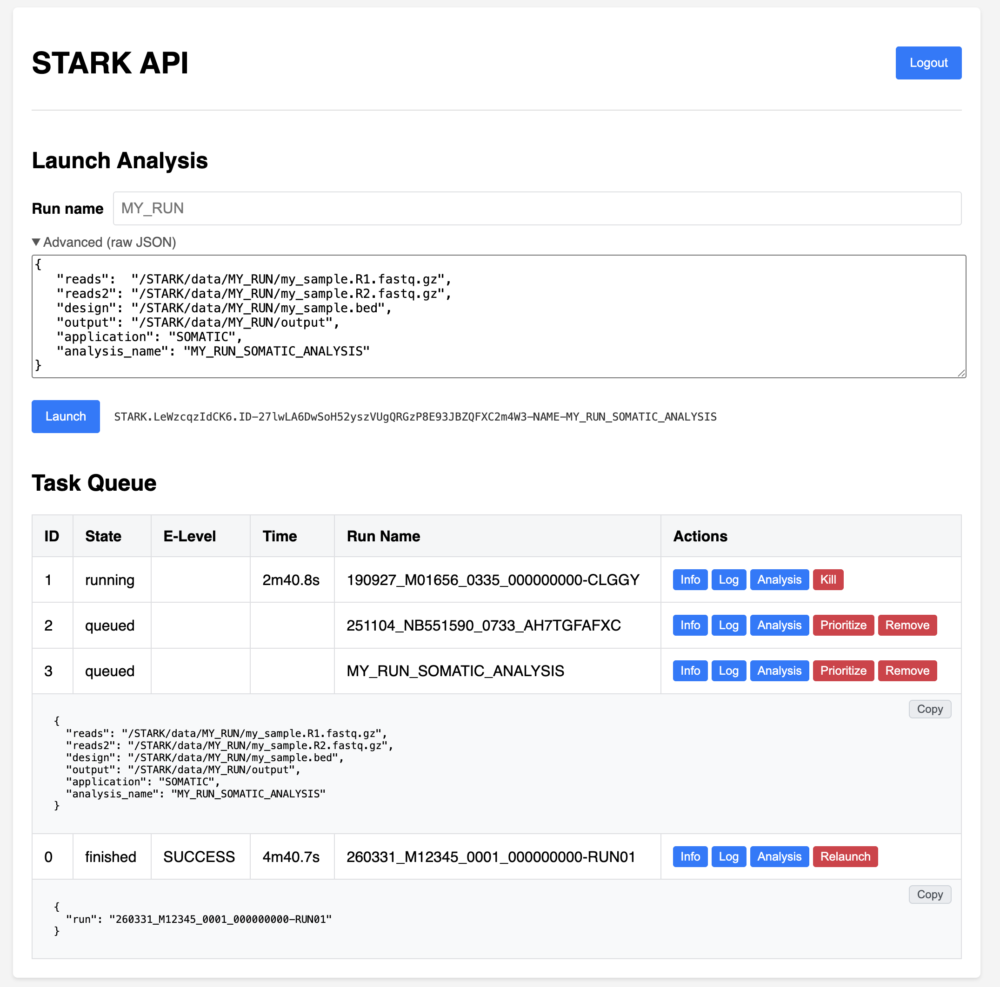
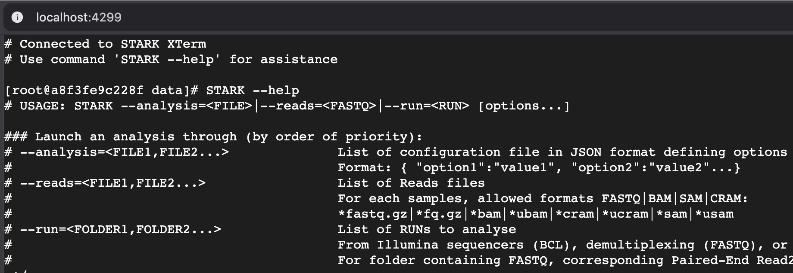
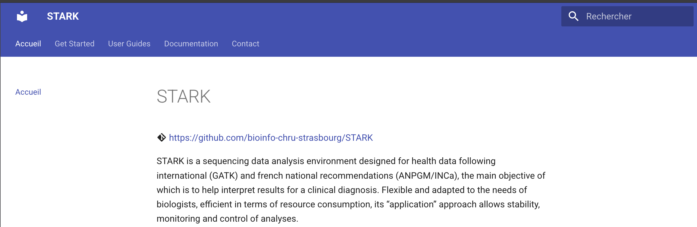

# STARK

STARK is a Next-Generation Sequencing data analysis pipeline for clinical diagnosis

- Stellar Tools for variants Analysis and RanKing
- Author: Antony Le Béchec
- Copyright: HUS/CPS
- License: GNU GPLA V3

## Introduction

:material-git: [https://github.com/bioinfo-chru-strasbourg/STARK](https://github.com/bioinfo-chru-strasbourg/STARK)

STARK is a sequencing data analysis environment designed for health data following international (GATK) and french national recommendations (ANPGM/INCa), the main objective of which is to help interpret results for a clinical diagnosis. Flexible and adapted to the needs of biologists, efficient in terms of resource consumption, its “application” approach allows stability, monitoring and control of analyses.

STARK consists of a main structure (STARK-Core), defining the general configuration of the analysis environment, and a set of additional modules (STARK-Modules), available and administered independently. Based on Docker containerization technology, each STARK module is a set of Docker services for performing analyzes or providing interfaces. The main STARK module is made up of Docker services allowing you to launch analyzes from the command line (CLI service), via an application programming interface (API service), or automatically by detecting a run (listener service), also allows you to make the data available (DAS service).

STARK allows the analysis of raw, demultiplexed or aligned sequencing data (BCL, FASTQ, BAM, SAM CRAM), and generates annotated result files in VCF and TSV formats (interoperability with visualization/interpretation interfaces, spreadsheet) and reports (HTML and text format, summary of results, quality control, analysis traceability). STARK can analyze sequencing data in 2 different ways:

- The analysis of a complete Illumina sequencing (or “run”) uses the BCL files generated by the sequencers and the files of
configuration (SampleSheet), as well as the “Design” file containing the sequenced regions (Manifest).
- Analysis of independent samples from files containing sequenced reads (standard format FASTQ, BAM, SAM or
CRAM), as well as the “Design” file containing the sequenced regions (Manifest or bed).

Optionally, a “Panel” file containing the regions of interest and a “Transcripts” file containing the list of preferred transcripts can complement the analysis.

STARK performs the steps of demultiplexing, alignment (multiple aligners), post alignment (marking of duplicates, realignment and recalibration of BAMs, clipping of primers), detection of variants (multiple variant callers), annotation and prioritization of variants (according to their quality, probable pathogenicity, interest in pathology, etc.). All of these steps are performed by a constellation of reference tools (eg bcl2fastq, FastP, GATK, Picard, Samtools, Bcftools, VarScan) and complementary to each other, for specific analyzes (application), for each pathology, technology, data type, practice.

The available applications have been developed and tested for the analysis of data generated by capture or amplicon technology, with Illumina, Multiplicom and Agilent kits, for DNA and RNA sequencing data. These applications can detect constitutional or somatic mutations (substitutions or indels), low allelic frequency mosaics, and transcript fusions.

The STARK code is developed on the Makefile principle, which is to build a dependency graph of the files to be generated, by defining rules allowing these files to be generated. These rules constitute independent bricks that can be used to define applications. This philosophy allows a simple use of the code an evolution facilitated by the addition of additional rules (such as new aligners and callers). The Docker-in-Docker (DinD) principle allows to use additional tools with there docker image.

Also, these rules can be executed in parallel on several processors, allowing efficient execution of the analysis in terms of resources (scalable and distributed).

The development of STARK and the configuration of the applications follow the good practices and recommendations of the national (INCa and ANPGM) and international (GATK) scientific community.

See [STARK User guide](docs/user_guides/USER-GUIDE.en.19.0.0.md) for more information.

## Quick installation

Use curl from GitHub bioinfo-chru-strasbourg to setup STARK environment by default. This setup will build STARK docker image and setup folders (in "${HOME}/STARK") and needed databases.

```bash
mkdir -p ${HOME}/STARK && cd ${HOME}/STARK && curl https://raw.githubusercontent.com/bioinfo-chru-strasbourg/STARK/master/setup.sh | bash
```

See [STARK Installation](docs/documentation/installation.md) for more information.

## Quick access

STARK API (Application Program Interface) is available through URI <http://localhost:4200> and is accessible with a user account (default 'stark/password'). This service prodives an interface to run STARK analysis with run name or parameters in JSON format. The Task Queue list all tasks with informations and actions that depend on task stats.



For a command line access, STARK CLI (Command Line Interface) is started as a container to execute custom analyses with data and runs, available in STARK main folder (default `${HOME}/STARK`, with `${HOME}/STARK/data` corresponds to `/STARK/data`, with `${HOME}/STARK/input/runs` corresponds to `/STARK/input/runs`, etc.).
Connect to STARK CLI with Docker command:

```bash
docker exec -ti stark-module-stark-submodule-stark-service-cli bash
STARK --help
# USAGE: STARK --analysis=<FILE>|--reads=<FASTQ>|--run=<RUN> [options...]
...
```

In addition, STARK XTerm is a web interface providing a terminal to launch STARK command within STARK CLI service.
STARK XTerm is available through URI <http://localhost:4299> (by default, account 'stark/password').



See [STARK services](docs/documentation/services.md) for more information

## Quick docs

STARK Docs provides documentation such as a user guide and many other information to configure STARK analysis. STARK Docs is available through URI <http://localhost:4298> (by default) and provides a search engine to facilitate the exploration of documentation.



For more information about STARK Command, use `help` option.

```bash
docker exec stark-module-stark-submodule-stark-service-cli STARK --help
```

For informations about available applications (e.g. EXOME, GENOME, GERMLINE, SOMATIC), pipelines, tools, databases, use options:

```bash
### Information options
# --applications_infos                     Applications informations
#                                          Use --runs=<MyRun> to detect RAW FOLDER and APPLICATION of <MyRun>
#                                          Use --application=<MyApp> to show only <MyApp> informations
# --applications_infos_all                 Applications informations with all variables (--runs and --application option available)
# --pipelines_infos                        Pipelines informations
# --release_infos                          Pipelines with tools and databases information
# --tools_infos                            Tools release information
# --databases_infos                        Databases information
```

See [STARK Help](docs/documentation/help.md) for more information.

## Quick command

Either through STARK CLI or STARK XTerm, STARK command can be executed with your own data and runs (run names will be automatically found in input folder). STARL CLI can be used for a one shot command, or as a interactive mode.

STARK CLI with a one shot command

```bash
# Analyze FASTQ with a design file and generated results on an output folder, with a one shot command
docker exec stark-module-stark-submodule-stark-service-cli STARK --reads="/STARK/data/my_sample.R1.fastq.gz" --reads2="/STARK/data/my_sample.R2.fastq.gz" --design="/STARK/data/my_sample.bed" --application="default.app" --output="/STARK/data/my_output"
```

STARK CLI in interactive mode to launch multiple command in terminal

```bash
# Connect to STARK CLI
docker exec -ti stark-module-stark-submodule-stark-service-cli bash
# Launch a STARK analysis with FASTQ and a design
STARK --reads="/STARK/data/my_sample.R1.fastq.gz" --reads2="/STARK/data/my_sample.R2.fastq.gz" --design="/STARK/data/my_sample.bed" --application="default.app" --output="/STARK/data/my_output"
# Launch a STARK analysis for an entire Illumina run available in ${HOME}/STARK/input/runs, for results in repository folder ${HOME}/STARK/repository
STARK --run="MY_RUN" 
# Launch another tool such as BCFTools with your data
bcftools view /STARK/data/my_sample.vcf.gz
```

## Quick container

A specific STARK container can be created with Docker for custom commands. Mount any volumes you need, such as `/STARK/data` and `/STARK/databases` (needed for STARK analysis), to let them available in the container.

```bash
# Launch an docker terminal interface with a STARK container 
docker run --rm --name "STARK-terminal" -v ${HOME}/STARK/data:/STARK/data -v ${HOME}/STARK/databases:/STARK/databases --entrypoint="bash" -ti stark/stark:19.0.0
```

```bash
# Launch a STARK command with an docker STARK container 
docker run --rm --name "STARK-command" -v ${HOME}/STARK/data:/STARK/data -v ${HOME}/STARK/databases:/STARK/databases stark/stark:19.0.0 --reads="/STARK/data/my_sample.R1.fastq.gz" --reads2="/STARK/data/my_sample.R2.fastq.gz" --design="/STARK/data/my_sample.bed" --application="default.app" --output="/STARK/data/my_output"
```

```bash
# Launch a tool command with an docker STARK container 
docker run --rm --name "STARK-bcftools" -v ${HOME}/STARK/data:/STARK/data --entrypoint="bcftools" stark/stark:19.0.0 view /STARK/data/my_sample.vcf.gz
```

## STARK documentation

See [STARK documentations](docs/index.md) for more information
