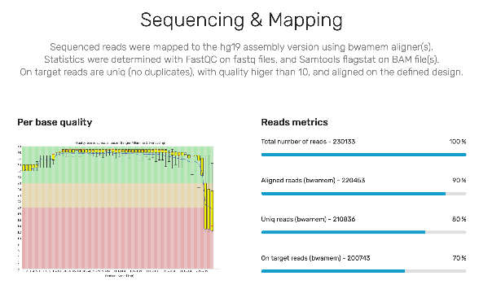
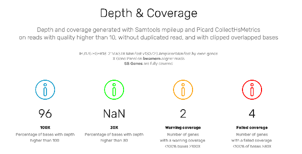

# Validation Method

Method for validating sequencing quality, alignment, and coverage of designs and gene panels.

## Definitions

- A **design** is the list of sequenced regions. Generally, it's a file provided by the kit supplier (Manifest/BED), translated into BED format.
- A **gene panel** is a list of regions grouped by genes. A gene is therefore a list of regions (usually exons). This is a file in BED format. A panel can be grouped by criteria other than genes: by exons, by gene groups (e.g., the BBS gene group, BRCA...).
- A **fastq file** is the list of sequenced reads, where each base is associated with a quality score. For Paired-End technology, 2 fastq files are generated, each having the exact same number of reads.
- A **BAM file** is a list of reads with associated information: the quality of each base, a tag (duplicate, short-read, secondary alignment, forward or reverse...), alignment coordinates (if aligned), the CIGAR string (if aligned)... A non-destructive BAM file is a BAM file that contains at least all the information from the fastq file(s).
- A **validation BAM file** is a list of "good quality" reads (quality >10, non-duplicates, not secondary alignments...), representing the reads used for variant calling. This BAM is used to assess the quality of coverage, the design, and the gene panels.
- **Depth** is the number of bases sequenced at a specific position on the genome. E.g., a depth of 42X at position chr1:123456 means that 42 bases (A, T, G, or C) have been sequenced at that position.
- **Coverage** is the percentage of bases where the depth is above a certain threshold for a given region. E.g., 98% of bases have a depth greater than 30X across all exons of gene X.

## Sequencing and Alignment Quality

On the non-destructive BAM, certain quality metrics are calculated.

Example:

- total number of reads,
- Q30 (percentage of bases with quality >30, averaged over the entire read length),
- base qualities (for each position in the reads),
- number of aligned reads (across the entire genome),
- non-duplicate reads (or unique reads).

## Depth and Coverage Validation

Depth and coverage calculations are performed on the validation BAM file.
These calculations can be applied to the design and to the gene panels, for initial validation and
for continuous validation (for each run).
The quality metrics can be calculated for all regions in a BED file
(globally), and per region/gene.

The parameters used are:

- the minimum depth threshold (e.g., 30X). Below this threshold, the position is considered
insufficiently sequenced (FAIL).

- the expected depth threshold (e.g., 100X). Below this threshold, the position is considered
correctly sequenced but raises a warning (WARN).

- the minimum coverage (e.g., 95%). Below this threshold, the region is considered insufficiently
covered (depending on the depth threshold considered).

The calculable metrics are:

- the number of ON-target reads, i.e., the number of "validated" reads on the considered regions/genes.

- the overall sequencing coverage, which is the percentage of bases with zero depth.
A percentage below 100% would indicate a problem in the design.

- the overall coverage at the minimum threshold (e.g., 98% at 30X). Coverage below the minimum
required coverage (e.g., 95%) would indicate a sequencing error, such as a technical issue or
a biological feature like a region deletion (e.g., coverage PASS).

- the overall coverage at the expected threshold (e.g., 94% at 100X). Coverage below the minimum
required coverage (e.g., 95%) would indicate sequencing that needs monitoring (e.g., coverage WARN).

- coverage per region/gene, identifying regions/genes that are:
- not sequenced (e.g., coverage <100% at 1X),
- insufficiently sequenced (e.g., coverage <95% at 30X), or
- under warning (e.g., coverage <95% at 100X).

## Screenshots of Metrics Available in STARK's Future Report

These screenshots show the progress of the prototype for the future report
(HTML, web page, PDF) of the next version of STARK (0.9.18b), for the validation
of sequencing, alignment, and gene panel coverage.
As this is a prototype, some points are not yet final, others are for example purposes,
and some are still missing (e.g., overall sequencing coverage).

