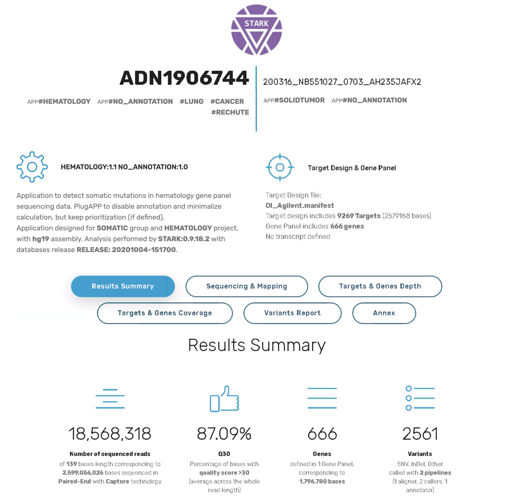
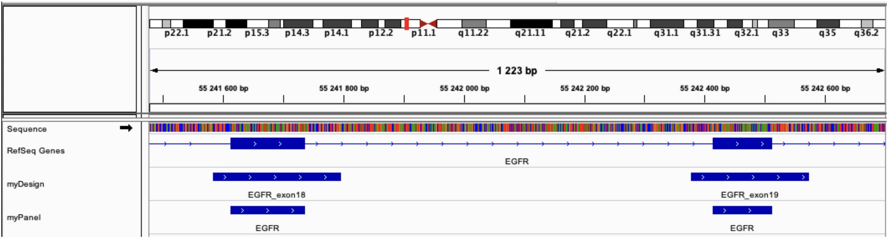

# STARK - USER GUIDE - version 0.9.18

## Stellar Tools from raw sequencing data Analysis to variant RanKing


- Introduction
- Prerequisites
- Quick start
   - Facility
   - Use
- Detailed installation
   - Download
   - Setup
   - Facility
   - Services
   - Directories
- STARK module
   - CLI service
   - API service
   - Service Listener and Cleaner
   - DAS Service
- Launch an analysis
   - Input data and parameters
   - Analysis by samples
   - Analysis per run
   - Analysis results
   - Analysis report
- Parameters of an analysis
   - Tags
   - SampleSheet
   - Apps
   - Designs, panels and transcripts preferred
- Contact
- Appendices


# Introduction

STARK is a sequencing data analysis environment designed for health data following international (GATK) and french national recommendations (ANPGM/INCa), the main objective of which is to help interpret results for a clinical diagnosis. Flexible and adapted to the needs of biologists, efficient in terms of resource consumption, its “application” approach allows stability, monitoring and control of analyses.

STARK consists of a main structure (STARK-Core), defining the general configuration of the analysis environment, and a set of additional modules (STARK-Modules), available and administered independently. Based on Docker containerization technology, each STARK module is a set of Docker services for performing analyzes or providing interfaces. The main STARK module is made up of Docker services allowing you to launch analyzes from the command line (CLI service), via an application programming interface (API service), or automatically by detecting a run (listener service), also allows you to make the data available (DAS service).

STARK allows the analysis of raw, demultiplexed or aligned sequencing data (BCL, FASTQ, BAM, SAM CRAM), and generates annotated result files in VCF and TSV formats (interoperability with visualization/interpretation interfaces, spreadsheet) and reports (HTML and text format, summary of results, quality control, analysis traceability). STARK can analyze sequencing data in 2 different ways:

- The analysis of a complete Illumina sequencing (or “run”) uses the BCL files generated by the sequencers and the files of
configuration (SampleSheet), as well as the “Design” file containing the sequenced regions (Manifest).
- Analysis of independent samples from files containing sequenced reads (standard format FASTQ, BAM, SAM or
CRAM), as well as the “Design” file containing the sequenced regions (Manifest or bed).

Optionally, a “Panel” file containing the regions of interest and a “Transcripts” file containing the list of preferred transcripts can complement the analysis.

STARK performs the steps of demultiplexing, alignment, post alignment (marking of duplicates, realignment and recalibration of BAMs, clipping of primers), detection of variants (calling), annotation and prioritization of variants (according to their quality, probable pathogenicity, interest in pathology, etc.). All of these steps are performed by a constellation of reference tools (eg bcl2fastq, FastP, GATK, Picard, Samtools, Bcftools, VarScan) and complementary to each other, for specific analyzes (application), for each pathology , technology, data type, practice.

The available applications have been developed and tested for the analysis of data generated by capture or amplicon technology, with Illumina, Multiplicom and Agilent kits. These applications can detect constitutional or somatic mutations (substitutions or indels), low allelic frequency mosaics.

The STARK code is developed on the Makefile principle, which is to build a dependency graph of the files to be generated, by defining rules allowing these files to be generated. These rules constitute independent bricks that can be used to define applications. This philosophy allows a simple use of the code an evolution facilitated by the addition of additional rules.

Also, these rules can be executed in parallel on several processors, allowing efficient execution of the analysis in terms of resources (scalable and distributed).

The development of STARK and the configuration of the applications follow the good practices and recommendations of the national (INCa and ANPGM) and international (GATK) scientific community.


# Prerequisites

OS: All systems allowing the installation of the Docker service (tested on CentOS 7 and MacOS 11.x).

CPU: At least 2 CPUs are required and ideally 8 CPUs are recommended.

RAM: At least 8GB of RAM per CPU and ideally 64GB of RAM. The application is particularly memory-intensive when aligning sequences with BWA and annotating variants with SnpEff, due to genome loading and annotation databases.

STORAGE: At least 500GB of space is required to store the tools and databases, to create a temporary space for analysis, and to accommodate a minimum of raw data and result data.

Note:
- Dimension of the number of CPU, RAM and STORAGE in relation to the activity (number of samples, panel of genes,
exomes, genomes, etc.).
- External assemblies are possible, in particular for the areas of raw data and results and archiving data which
will increase as the activity progresses.

# Quick start

In order to facilitate deployment, STARK environment is available in Docker, containing required tools (binaries) and an automatic installation of mandatory databases.

The scripts allowing to build the STARK environment as well as a more detailed description of the installation and the configuration are available on GitHub (https://github.com/bioinfo-chru-strasbourg/STARK). The STARK environment consists of a main structure (STARK-Core) and a set of additional modules (STARK-Modules). A STARK module is a set of Docker services.

Some tools are licensed (eg GATK, ANNOVAR).

## Facility

The simplified installation allows you to download the STARK scripts, install STARK-Core (build Docker images, configure the directory structure and download databases), and start the Docker services of the main STARK module, by following command:

```
$ mkdir -p ${HOME}/STARK && cd ${HOME}/STARK && curl https://github.com/bioinfo-chru-strasbourg/STARK/raw/master/setup.sh | bash
```

Step-by-step installation is detailed in the Detailed Installation section.

## Use

The following command details the parameters and options for launching a command-line scan:

```
$ docker exec stark-module-stark-submodule-stark-service-cli STARK --help
```

The following command allows a use of the STARK environment in command line:

```
$ docker exec -ti stark-module-stark-submodule-stark-service-cli bash
```

The STARK module and its services are detailed in the STARK module section.


# Detailed installation

## Download

Creating a STARK-bin installation directory and downloading STARK scripts:

```
$ mkdir -p ${HOME}/STARK-bin
$ cd ${HOME}/STARK-bin
$ git clone https://github.com/bioinfo-chru-strasbourg/STARK.git.
```

## Setup

The configuration of the STARK environment is controlled by the ".env" environment file at the root of the installation directory. This file is used to define the information for creating the main image of STARK, the data directories, and the configuration of the STARK network associated with the various modules and additional services. The default configuration is suitable for most infrastructures, the only variable in the main STARK-data directory can be modified as needed:

```
DOCKER_STARK_MAIN_FOLDER=${HOME}/STARK
```

In the case of a custom environment configuration, the variables in the main ".env" configuration file must correspond to the variables used in the docker structure of the "docker-compose.yml" file. Also, the configuration of services may need to be adapted.

## Facility

Building the main STARK environment docker image is done by the docker-compose command, as well as installing it. This installation will create (if necessary) the STARK-data data directory (this directory must be previously created) and the subdirectories, deploy the necessary databases, and archive the sources that allowed the creation of the STARK environment. The “--project-name STARK” parameter ensures deployment of the environment in the “stark” docker stack. Below are the step-by-step commands:

```
$ mkdir -p $(source ${HOME}/STARK-bin/.env; echo $DOCKER_STARK_MAIN_FOLDER)
$ docker-compose build
$ docker-compose --project-name STARK up stark-setup
$ docker-compose --project-name STARK up stark-databases
$ docker-compose --project-name STARK up stark-sources-archives
```

## Services

Services are located in the "STARK-bin/services" folder and are organized into modules and sub-modules (by directory). Each module contains a "STARK.docker-compose.yml" file describing the main services (can be empty), the "STARK.module" file describing the module (JSON format), and the "STARK.env" file including all the main parameters of the modules, in particular to share the variables common to the sub-modules. Each submodule directory contains the same files, describing each associated service and its parameters. Help is available with the --help option, modules are selected with the --modules option, submodules with the --submodules option, and services with --services. The available modules and submodules are listed by the --modules_show option. The state of services is managed by the —command option.

```
$services/services.sh --help
$ services/services.sh --modules=* --command=up
$ services/services.sh --modules=* --command=down
$ services/services.sh --modules=myModule1,myModule2 --command=up
$ services/services.sh --modules=MyModule --command=up
$ services/services.sh --modules=MyModule --submodules=MySubModule --command=up
$ services/services.sh --modules=MyModule --submodules=MySubModule --services=MyService --command=up
$ services/services.sh --modules_show
```

## Directories

The STARK-bin directory contains all the scripts downloaded during the installation of STARK, and the environment configuration files. Below are the main scripts, configuration files and subdirectories:

```
STARK-bin
.
├── bin                    # main STARK scripts
│ └── STARK                # main STARK script
├── config                 # configure scans
│ ├── apps                 # configuration of pre-installed apps
│ ├── howard               # annotation default configuration and variant prioritization
│ └── rules                # configure main makefile rules
├── docs                   # documentation
├── services               # additional modules
│ ├── stark                # main module of STARK
│ ├── ...                  # additional modules
│ ├── STARK.env            # main modules configuration
│ └── services.sh          # module management script
├── sources                # packages and third-party tools needed for installation
├── toolbox                # additional scripts
├── setup.sh               # automatic install script
└── .env                   # STARK environment setup
```

The STARK-data directory contains the structure of the subdirectories containing the input data, the results of the analyzes (or run), the databases, the configuration files and the logs of the modules. Below are the main sub-directories:

```
STARK-data
.
├── config                 # module configuration
│ ├── stark                # configuration of the main module of STARK
│ ├── howard               # annotation setup and variant prioritization
│ ├── myapp                # configuration of additional applications
│ └── ...                  # configuration of additional modules (per directory)
├── data                   # additional data directory (free structure)
├── databases              # set of databases
│ ├── annovar              # collection of variant annotation databases by ANNOVAR
│ ├── dbsnp                # dbSNP database
│ ├── genomes              # genomes
│ ├── refGene              # refSeq and refGene database
│ ├── snpeff               # collection of variant annotation databases by snpEff
│ └── ...                  # additional databases (per directory)
├── input                  # main input data directory
│ ├── manifests            # design directory, gene panels and preferred transcript list
│ └── runs                 # Illumina runs directory
├── output                 # main directory of scan results
│ ├── archives             # analysis archiving, by group, project and run
│ ├── demuxing             # demuxing of Illumina runs, per run (off by default)
│ ├── repository           # directory before archiving (synchronization required, inactive by default)
│ ├── repository           # analysis repository directory, by group, project and run
│ ├── results              # directory of analysis results, per run (inactive by default)
│ └── tmp                  # temporary analysis directory (inactive by default)
├── services               # main directory of additional STARK modules
│ ├── stark                # main module of STARK
│ └── ...                  # STARK addition modules
└── sources                # directories containing STARK sources (3rd party packages and tools)
```

# STARK module

To start the main STARK module, composed of a single STARK sub-module, including the CLI (Command Line Interface), API (Application Program Interface), Listener (and its cleaning service), and DAS (DAta Sharing ):

```
$ services/services.sh --modules=stark --command=up
```

### CLI Service

The CLI (Command Line Interface) service is a Docker container (stark-module-stark-submodule-stark-service-cli) that allows you to run custom analyzes from the runs available in the STARK-data/input/runs directory , or data present in the STARK-data/data directory. By default, the STARK-data data directory is available in the container via bind mount /STARK.

The service can be used directly from the command line, in interactive mode:

```
$ docker exec -ti stark-module-stark-submodule-stark-service-cli bash
```

Or non-interactive (example with the --help option):

```
$ docker exec stark-module-stark-submodule-stark-service-cli STARK --help
$ docker exec stark-module-stark-submodule-stark-service-cli STARK --run=myRun
$ docker exec stark-module-stark-submodule-stark-service-cli STARK --reads=/STARK/data/myData/myFastq --design=/STARK/data/myData/myDesign --application=myApplication --repository= /STARK/data/myData/myOutput
```

Also, third-party tools (example samtools, bcftools) are available on the command line:

```
$ docker exec stark-module-stark-submodule-stark-service-cli samtools
$ docker exec stark-module-stark-submodule-stark-service-cli bcftools
```

and can be listed by the find command line:

```
$ docker exec stark-module-stark-submodule-stark-service-cli bash -c "find /STARK/tools -mindepth 2 -maxdepth 2 -type d"
```

## API service

The API (Application Program Interface) service is a Docker container (stark-module-stark-submodule-stark-service-api), has a web server (help available), and is accessible via the URI address [http ://ip:port](http://ip:port) (by default [http://localhost:4200).](http://localhost:4200).) This service is an interface allowing to put a queued STARK command via JSON-formatted parameters:

- [http://localhost:4200/analysis?json={"run":"myRun"}](http://localhost:4200/analysis?json={"run":"myRun"})

and manage the command queue:

- [http://localhost:4200/queue?help&format=html](http://localhost:4200/queue?help&format=html)

Queuing can also be managed by the curl command, such as queuing a STARK command:

```
$ curl [http://localhost:4200/queue?help](http://localhost:4200/queue?help)
$ curl [http://localhost:4200/queue?list](http://localhost:4200/queue?list)
$ curl -X POST -H 'Content-Type: application/json' -d '{"run":"myRun"}' [http://localhost:4200/analysis](http://localhost:4200/analysis )
```

## Service Listener and Cleaner

The Listener service is a Docker container (stark-module-stark-submodule-stark-service-listener) is run as a daemon, and allows you to listen if new runs have been filed (in the STARK-data/input directory /runs), and send a run command to the API service. A run is considered to be analyzed if it is completed (RTAComplete.txt), configured with a SampleSheet (SampleSheet.csv), and sufficiently recent (10 days by default).

The Listener cleaner service is a Docker container (stark-module-stark-submodule-stark-service-listenerclean) which checks, only once when starting or restarting the service, if the queued runs have been launched, and restarts them if necessary (useful after a failure or an unexpected shutdown of the server).


## DAS Service

The DAS (DAta Sharing) service is a Docker container (stark-module-stark-submodule-stark-service-das), has a web server (help available), and is accessible via the URI address [http: //ip:port/publicPath/myPath](http://ip:port/publicPath/myPath) (default [http://localhost:4201/static/data/public/myPath)](http://localhost :4201/static/data/public/myPath))

This service can be used with applications that can open files by URI (such as IGV), or to share data between STARK module services. By default, the data made available are:

Database data:

- [http://localhost:4201/static/data/public/inputs/Input/runs](http://localhost:4201/static/data/public/inputs/Input/runs)

Input data:

- [http://localhost:4201/static/data/public/inputs/Input/manifests](http://localhost:4201/static/data/public/inputs/Input/manifests)
- [http://localhost:4201/static/data/public/databases](http://localhost:4201/static/data/public/databases)^

Output data:

- [http://localhost:4201/static/data/public/repositories/Repository](http://localhost:4201/static/data/public/repositories/Repository)
- [http://localhost:4201/static/data/public/repositories/Archives](http://localhost:4201/static/data/public/repositories/Archives)
- [http://localhost:4201/static/data/public/data](http://localhost:4201/static/data/public/data)^


# Run a scan

## Input data and parameters

It is possible to launch a STARK analysis on one or more samples (FASTQ, BAM) or directly from a run, allowing in particular a complete analysis of runs at the output of the Illumina sequencer (BCL).

_Minimum information required to start an analysis by sample or by run Illumina_

| File | Description |
|--------------|--------------|
| Reads | Analysis from fastq, bam, sam, cram read files. <br>Mandatory (analysis by samples) |
| runs | Analysis from an Illumina run directory (raw data, multiplied) or containing read files. <br>Mandatory (analysis by runs) |
| Designer | Sequenced regions (BED or Illumina Manifest format). <br>Default: whole genome analysis. |
| Application | Set of parameters defining a specific application. <br>Default: default.app |
| Sample Sheet | File containing the information needed to set up an Illumina run, including the list of samples. <br>Mandatory (analysis by runs) |


_Main settings/options available_

| Parameter | Size | Description |
|----------------|--------------|--------------|
| ```--analysis``` | ```<FILE1,FILE2...>``` | List of settings/options files in JSON format. <br>Format: *json {"option1":"value1", "option2":"value2"...} |
| ```--analysis_name``` | ```<STRING>``` | Analysis name (default run name). <br>Format: analysis |
| ```--reads``` | ```<FILE1,FILE2...>``` | The list of FASTQ/BAM/SAM/CRAM read files. <br>Formats: *fastq, *fastq.gz, *bam, *sam, *cram |
| ```--run``` | ```<FOLDER1,FOLDER2...>``` | The list of run directories to scan. <br>Format: directory in Illumina format or containing read files |
| ```--application``` | ```<STRING1,STRING2...>``` | List of application names or paths to application files. <br>Format: app , *app |
| ```--design``` | ```<FILE1,FILE2...>``` | List of design files (sequenced regions). <br>Format: *bed, *manifest (or other extension) |
| ```--genes``` | ```<FILE1,FILE2...>``` | List of gene panel files (regions of interest). <br>Format: *genes |
| ```--transcripts``` | ```<FILE1,FILE2...>``` | List of preference transcript files. <br>Format: *transcripts |
| ```--results``` | ```<FOLDER>``` | Directory containing the results of an analysis |
| ```--help``` | ```<FILE1,FILE2...>``` | List of parameters and options |


## Analysis by samples

Analysis by sample makes it possible to specify the read files to be processed (FASTQ, BAM, SAM, CRAM), as well as the application to be used, the sequenced and regions of interest, the preference transcripts, the output directory of results.

Example of minimum order:

```
$ STARK --reads=MyBam.bam --results=/path/to/My/Results/
```

Example command with parameters:

```
$ STARK --application=GERMLINE --analysis_name=MyAnalysis --design=MyRegions.bed --genes=MyPanel.genes
--transcripts=MyTranscripts.transcripts --results=/path/to/My/Results/
--reads=SAMPLE_A.R1.fastq.gz,SAMPLE_B.R1.fastq.gz --reads2=SAMPLE_A.R2.fastq.gz,SAMPLE_B.R2.fastq.gz
```

Note:
- The available applications are listed by the --applications_infos option.

## Analysis per run

Analysis by run is designed to process an Illumina directory containing raw (BCL) or demultiplexed (FASTQ) data directly at the sequencer output, or a directory containing a set of read files (FASTQ, BAM, SAM, CRAM ). In the case of an Illumina directory, it is necessary to specify the SampleSheet or to deposit it in the run folder (https://emea.support.illumina.com).

Minimal command example (run present in input directory input/runs):

```
$STARK --runs=MyRun
```

Example command with parameters:

```
$ STARK --runs=/My/Run/folder --application=EXOME --results=/path/to/My/Results/
```

### Analysis results

The results of an analysis (or run) are available in the “repository” type directories (by default archives, depository and repository), and are organized by group, project and analysis. Below are the main result files:

```
STARK-analysis
.
├── Sample1                            # sample results directory Sample
│ ├── Sample1.ID.stark.report.html     # ID analysis report in HTML format
│ ├── Sample1.Panel1.genes             # gene panel 1
│ ├── Sample1.Panel2.genes             # gene panel 2
│ ├── Sample1.archive.cram             # raw and aligned reads (for archives)
│ ├── Sample1.*.validation.bam         # aligned and filtered reads (for calculating metrics)
│ ├── Sample1.bed                      # design of sequenced regions in BED format
│ ├── Sample1.final.Panel1.*.tsv       # list of variants on Panel1 in TSV format
│ ├── Sample1.final.Panel1.*.vcf.gz    # list of variants on Panel1 in VCF format
│ ├── Sample1.final.Panel2.*.tsv       # list of variants on Panel2 in TSV format
│ ├── Sample1.final.Panel2.*.vcf.gz    # list of variants on Panel2 in VCF format
│ ├── Sample1.full.Design.tsv          # list of variants by caller on Design in TSV format
│ ├── Sample1.full.Design.vcf.gz       # list of variants by caller on Design in VCF format
│ ├── Sample1.launch.json              # configuration file for rescan
│ ├── Sample1.manifest                 # design of sequenced regions in Illumina format
│ ├── STARK                            # directory containing all STARK result files
│ └── ...                              # addon results directories
├── Sample2                            # sample results directory Sample
├── ...                                # directory of other sample results
├── analysis.ID.config                 # configuration and versions of analysis ID
├── analysis.ID.metrics.*              # metrics files for the entire ID analysis run
└── analysis.ID.variants.*             # list of variants of all samples (VCF, TSV)
```

## Analysis report

An analysis report provides an overview of the results generated at each step of the analysis.

The report header indicates the sample concerned, as well as the name of the analysis (or run), and the associated tags. This header also indicates, in the "Results Summary" section, the information concerning the application used (name and version, description, group and project), the version of STARK and the databases, as well as information on the design, gene panel(s) and preferred transcripts. A summary of the main indicators also provides an overall view of the quality of the analysis (eg number of reads and sequenced bases, quality score, number of genes and variants).

Several sections then summarize, using quality indicators, the results of the analysis. The “Sequencing & Mapping” section details in particular the number of reads sequenced and their quality (quality ratio), aligned, and validated (quality filter). The “Targets & Genes Depth” section summarizes the regions whose depth is sufficient, or does not pass the quality thresholds. The “Targets & Genes Coverage” section summarizes the regions with sufficient coverage, or which do not pass the quality thresholds. The “Variants Report” section summarizes the variants found, according to their type. The “Annex” section details the previous sections in more detail, in particular through dynamic tables to facilitate the search for regions or variants.

Sample STARK Analysis Report Header




# Analysis parameters

## Tags

The STARK tagging system is used to add meta-information, in the form of keywords, to samples, or to automatically parameterize STARK analyzes or add-on modules through the use of a SampleSheet. The meta-information for the samples can allow the addition of important information in order to help the biological interpretation (for example the type of pathology, the age of the patient, the sex of the patient, the biological material used).

### Tag format

STARK's tag format is the standard format of a hashtag (composed of the typographic sign "#" followed by the keyword, or TAG), to which is added a TYPE as a prefix (optional). Tags with the same type can be grouped together. STARK tags can be listed using the typological sign "!" ".

```
[TYPE]#TAG[#TAG][![TYPE]#TAG[#TAG]]
```

_Examples of tags_

```
#cancer                                         # Simple typeless “cancer” tag
#cancer!#lymphoma!#female                       # Typeless simple tag list
PATHOLOGY#cancer                                # Tag "cancer" typed "PATHOLOGY"
PATHOLOGY#cancer!PATHOLOGY#lymphoma             # Multiple tags typed “PATHOLOGY”
PATHOLOGY#cancer#lymphoma                       # Multiple typed “PATHOLOGY” tags grouped together
PATHOLOGY#cancer#lymphoma!SEX#female!#blood     # List of typed and untyped tags
```

## SampleSheet

A sample sheet, or SampleSheet (Illumina), is required for each analysis per run. This file can be placed in the root of the run directory, with the name SampleSheet.csv, for automatic analysis, or used in manual mode with the --samplesheet option.

A SampleSheet is a CSV (comma-separated values) file that stores information needed to set up, run, and analyze a sequencing run. A SampleSheet can be created using Illumina Experiment Manager (Illumina) or manually using a text editor (Excel or Notepad). A SampleSheet is organized into sections.

Configuring a run for a STARK analysis is done by adding tags. Specifically, the APP tag is used to associate the STARK application to the whole run, and/or to each sample of the run. Thus, the default application for all samples of the run is the one entered in the "Description" field of the "Header" section. Each sample can be analyzed with a specific application by entering the application in the "Description" field of the sample table in the "Data" section.

Other tags can be used to configure additional STARK modules (see the help for each module).

_Example of SampleSheet_

```
[Header]                                           # Section Header
Description,APP#EXOME                              # Default EXOME application for run
...                                                # Other information from the Header section
[Data]                                             # Section Data
Sample_ID,...,Description                          # Samples table header
SAMPLE1,...,,...                                   # Default run application
SAMPLE2,...,APP#GERMLINE,...                       # Specific application GERMLINE
SAMPLE3,...,APP#SOMATIC!PATHOLOGY#lymphoma,...     # Specific SOMATIC application
...                                                # Other samples from the Data section
```


## Apps

A STARK application is a set of variables allowing the specific configuration for an analysis (example: small panel of genes by amplicon technology, exome by capture technology, identification of somatic mutations). The available applications can be listed by the --applications_infos option. Applications are stored in the STARK-bin/config/apps directory as a file with the extension “.app” (Linux environment file format). A default application “default.app” is used if no application is defined when launching an analysis.

Variables can be described under several sections. Below, the main sections and variables (see default.app).

### Application information and description

This information describes the application. In particular, the group and project information will determine the sub-directories in which the analyzes will be deposited (in the repository and archive directories).

```
APP_NAME="DEFAULT"                        # Application name
APP_RELEASE="1.1"                         # Application release
APP_DESCRIPTION="Default application"     # Application description
APP_GROUP=""                              # Application group (UNKNOWN by default)
APP_PROJECT=""                            # Application project (UNKNOWN by default)
```

### Main settings

Principal variables are used at several stages of the analysis, such as alignment, calling, and annotation.

```
ASSEMBLY=hg19 # Assemble genome (auto-detected in manifest)
THREADS=AUTO # Number of processor (number of cores - 1 by default)
```

### Demultiplexing and FASTQ

The demultiplexing step makes it possible to extract the reads (FASTQ) from the raw data (BCL). These reads can be filtered and processed through additional steps.

```
BARCODE_MISMATCHES=1          # Number of mismatches for each read
DETECT_ADAPTER_FOR_PE=0       # Auto-detection of paired-end adapters
FASTQ_QUALITY_FILTERING=""    # Read quality threshold
POST_SEQUENCING_STEPS=""      # Post sequencing steps
```

### Pipelines and post-processing

A pipeline is a sequence of alignment, calling and annotation steps (“Aligner.Caller.Annotator” format). Several pipelines can be populated and executed in parallel (format “Aligner1.Caller1.Annotator1,Aligner2.Caller2.Annotator2”). Also, several post-processing steps make it possible to adjust the pipelines. The --pipelines_infos option offers the set of available stages.

```
PIPELINES="bwamem.gatkHC.howard"                                                    # List of pipelines
POST_ALIGNMENT_STEPS="sorting markduplicates realignment recalibration compress"    # Post alignment
POST_CALLING_STEPS="normalization recalibration filtration"                         # Post calling
POST_ANNOTATION_STEPS="sorting recalibration normalization"                         # Post annotation
```

### Annotation

The annotation variables allow you to configure the annotations, the calculations, the prioritization of the variants, and the fields to be displayed in the report in TCV format (see HOWARD). These annotation steps are performed for each pipeline, when generating the report in VCF (combination of all pipelines), and at the analysis level (combination of all samples). Below are the annotation variables for the results of the pipelines and the report:

```
HOWARD_ANNOTATION="core,snpeff"                                         # List of annotations by type
HOWARD_CALCULATION="VARTYPE,NOMEN"                                      # List of calculations
HOWARD_PRIORITIZATION="default"                                         # Prioritizations
HOWARD_FIELDS="NOMEN,location,outcome,snpeff_impact"                    # Fields to display in TSV
HOWARD_ANNOTATION_REPORT="core,frequency,score,prediction,snpeff"       # List of annotations by type
HOWARD_CALCULATION_REPORT="VAF_STATS,DP_STATS,VARTYPE,NOMEN,BARCODE"    # List of calculations
HOWARD_PRIORITIZATION_REPORT="default"                                  # Prioritizations
HOWARD_FIELDS_REPORT="NOMEN,location,outcome,snpeff_impact,ALL"         # Fields to display in TSV
```

### Metrics

The metrics make it possible to evaluate in particular the quality of sequencing and alignment of the reads. For each sample and aligner), a validation file (sample.aligner.validation.bam) is generated according to the following quality criteria:

```
METRICS_MINIMUM_MAPPING_QUALITY=10                 # Minimum mapping quality of a read
METRICS_MINIMUM_BASE_QUALITY=10                    # Minimum mapping quality of a read base
CLIP_OVERLAPPING_READS=1                           # Depth calculated only once per read paired
METRICS_FLAGS="UNMAP,SECONDARY,QCFAIL,DUP"         # Don't consider reads with these flags
COVERAGE_CRITERIA="1,5,10,20,30,50,100,200,300"    # Depths to consider for coverage
```

### Reports

In order to generate indicators on the quality metrics, certain thresholds can be configured. A depth threshold is defined by the base number, a coverage threshold is defined by a percentage (from 0 to 1).

```
SEQUENCING_DEPTH="1"                # Sequencing depth threshold
SEQUENCING_COVERAGE_THRESHOLD="1"   # Sequencing coverage threshold
MINIMUM_DEPTH="30"                  # Minimum depth threshold
EXPECTED_DEPTH="100"                # Expected depth threshold
DEPTH_COVERAGE_THRESHOLD="0.95"  # Coverage threshold for minimum and expected depths
```

### Additional app

Additional applications can be configured to meet the needs of each analysis. Thus, to facilitate the creation of new applications, the inheritance principal makes it possible to modify the configuration of an existing application by changing only the necessary variables. As an example, below is the configuration of an application dedicated to mosaic detection and its use:

```
# Legacy
source_app "GERMLINE"                  # Inheritance of the GERMLINE application

# App description
APP_NAME="myAppMosaic"                 # Name of the new application
APP_RELEASE="1.0"                      # New app release
APP_DESCRIPTION="My App for Mosaic"    # Description of the new app
APP_GROUP="myGroup"                    # New application group
APP_PROJECT="myProject"                # New application project

# Setup
PIPELINES=$PIPELINES" bwamem.outLyzer.howard"      # Adding the pipeline with the caller outLyzer
HOWARD_PRIORITIZATION="myAppPrioritization"        # Using configured prioritization
COVERAGE_CRITERIA=$COVERAGE_CRITERIA",500,1000"    # Add depths for metrics
MINIMUM_DEPTH="100"                                # Definition of a minimum depth threshold
EXPECTED_DEPTH="300"                               # Definition of an expected depth threshold
```

_Use_

```
APP#myAppMosaic               # TAG SampleSheet with myAppMosaic apps
--application=myAppMosaic     # Parameter with applications myAppMosaic
```

In the same way, it is possible to define application plugins, or plugApp. It is then a question of configuring the application without inheritance. This plugApp can then be used in addition to the main application, either by the --application parameter or by the APP tag in the SampleSheet. Below, the configuration of a plugAPP and its use:

```
# App description
APP_NAME="myPlugAppMosaic"                # Name of the new plugApp
APP_RELEASE="1.0"                         # Version of the new plugApp
APP_DESCRIPTION="My plugApp for Mosaic"   # Description of the new plugApp

# Setup
PIPELINES=$PIPELINES" bwamem.outLyzer.howard"      # Adding the pipeline with the caller outLyzer
HOWARD_PRIORITIZATION="myAppPrioritization"        # Using configured prioritization
COVERAGE_CRITERIA=$COVERAGE_CRITERIA",500,1000"    # Add depths for metrics
MINIMUM_DEPTH="100"                                # Definition of a minimum depth threshold
EXPECTED_DEPTH="300"                               # Definition of an expected depth threshold
```

_Use_

```
APP#GERMLINE#myPlugAppMosaic              # TAG SampleSheet with GERMLINE apps
APP#EXOME#myPlugAppMosaic                 # TAG SampleSheet with EXOME Apps
--application=GERMLINE,myPlugAppMosaic    # Parameter with GERMLINE applications
--application=EXOME,myPlugAppMosaic       # Parameter with EXOME applications
```

## Designs, panels and transcripts preferred

A STARK analysis takes into account a design (sequenced regions), a panel (regions of interest, or genes) and the preferred transcripts. For run analysis, files are detected in the STARK-data/input/manifests directory.

### Design

A design is the set of regions used during the sequencing step, generally defined by the supplier of the sequencing kit, and makes it possible to define the regions on which the variants will be identified and the quality metrics calculated (depth and coverage) .

The design file can be in BED (.bed) or Illumina Manifest (.manifest, .AmpliconManifest, or .txt) format, and this format is automatically detected (by extension). Only one design can be provided for a STARK analysis, and a design is automatically generated from the alignment of the reads in case it is not provided. Only a file in Manifest format can be used to define the primers in the case of Amplicon technology, unlike a file in BED format. The BED format file will be generated from the Manifest format file if any.

Example of file in Manifest format:

```
[Header]
ReferenceGenome Homo_sapiens\UCSC\hg19\Sequence\WholeGenomeFASTA
[Regions]
Name Chromosome Start Stop Upstream Probe Length Downstream Probe Length
EGFR_exon18     chr7    55241584    55241796    29  30
EGFR_exon19     chr7    55242379    55242574    30  30
BRCA1_exon03    chr17   41267697    41267876    30  21
BRCA1_exon02    chr17   41275968    41276169    28  22
```

Example of file in BED format:

```
track name="myDesign" description="myDesign for genes EGFR and BRCA1"
chr7    55241583    55241796    EGFR_exon18     0   +
chr7    55242378    55242574    EGFR_exon19     0   +
chr17   41267696    41267876    BRCA1_exon03    0   -
chr17   41275967    41276169    BRCA1_exon02    0   -
```

### Panel

A panel is a set of regions grouped into regions of interest. In particular, a panel of genes makes it possible to group together all the exons of a gene under the same region of interest “gene”, in order in particular to calculate the quality metrics per gene (depth and coverage). A panel is made "to order" and can contain any regions of interest (eg exons, introns, inter-gene regions) grouped together as needed.

The panel file is in BED format and has the extension “.genes”. Several panels can be provided for a STARK analysis, and a panel is automatically generated from the refGene database (all gene exons and transcripts sequenced by at least one base) in case it is not provided. For run analysis, panels are detected from the design file (d _esign_ *.genes)

Example of file in BED format:

```
track name="myPanel" description="myPanel for for genes EGFR and BRCA1"
chr7    55241613    55241736    EGFR    0   +
chr7    55242414    55242513    EGFR    0   +
chr17   41267742    41267796    BRCA1   0   -
chr17   41276033    41376132    BRCA1   0   -
```

### Preferably transcribed

The variant annotation step lists a set of HGVS annotations, and then determines a NOMEN, ie a single HGVS annotation. The list of preferred transcripts makes it possible to choose the desired transcripts, for each gene, among the HGVS annotations of the variants. If no transcript is defined for a gene, the annotation step will choose the HGVS annotation according to the calculation of a relevance score.

The preferred transcript file is in TSV (Tabulation-Separated Values) format, and has two columns: a transcript (mandatory) and a gene name (optional). In the case of multiple preference transcripts for a gene, the priority transcript is the one arriving first in the list.

Example of file in TSV format:

```
NM_005228.3 EGFR    # transcrit EGFR principal
NM_201282.2 EGFR    # transcrit EGFR secondaire
NM_007294.3 BRCA1   # transcrit BRCA1 principal
```

_Representation on IGV of the Design and the Panel of the EGFR regions (exon 18 and exon 19):_




# Contact

BIOINFORMATICS PLATFORM

Strasbourg University Hospitals (UF7363)

1, place of the hospital, 67091 Strasbourg

+33 3 88 12 75 38

bioinfo@chru-strasbourg.fr


# REVISION HISTORY

**Date of revision Reason for revision**

17-11-2017 Creation of the Document

2018-06-15 Updated for version 0.9.16b

09-10-2018 Update for version 0.9.17b

12-02-2021 Update for version 0.9.18


# Appendices

## Data directories

This directory (STARK-data) contains the structure of the sub-directories containing the input data, the results of the analyzes (or run), the databases, the configuration files and the logs of the modules. Below are the main sub-directories:

```
STARK-data
.
├── config        # module configuration
│ ├── stark       # configuration of the main module of STARK
│ ├── howard      # annotation setup and variant prioritization
│ ├── myapp       # configuration of additional applications
│ └── ...         # configuration of additional modules (per directory)
├── data          # additional data directory (free structure)
├── databases     # set of databases
│ ├── annovar     # collection of variant annotation databases by ANNOVAR
│ ├── dbsnp       # dbSNP database
│ ├── genomes     # genomes
│ ├── refGene     # refSeq and refGene database
│ ├── snpeff      # collection of variant annotation databases by snpEff
│ └── ...         # additional databases
├── input         # main input data directory
│ ├── manifests   # design directory, gene panels and preference transcript list
│ └── runs        # Illumina runs directory
├── output        # main directory of scan results
│ ├── archives    # analysis archiving, by group, project and run
│ ├── demuxing    # demuxing of Illumina runs, per run (off by default)
│ ├── repository  # directory before archiving (synchronization required, inactive by default)
│ ├── repository  # analysis repository directory, by group, project and run
│ ├── results     # directory of analysis results, per run (inactive by default)
│ └── tmp         # temporary analysis directory (inactive by default)
├── services      # main directory of additional STARK modules
│ ├── stark       # main module of STARK
│ └── ...         # STARK addition modules
└── sources       # directories containing STARK sources (3rd party packages and tools)
```

## Input data

The _input_ directory contains sequencing data and associated parameter files.

### Sequencing data

Directory gathering Illumina runs from sequencers. Each directory represents an Illumina run.

```
/input/runs
```

### Designs, panels and transcripts preferred

Directory of designs, gene panels, list of preferred transcripts, used for sequencing data analysis

```
/input/manifests
```

### Additional data

```
/data
```

## Result data

The _output_ directory containing the results generated by STARK

### Temporary directory

Temporary directory used to generate intermediate results

```
/output/tmp
```

### Demultiplexing directory

Run demultiplexing directory, notably generating the fastq.gz read files for each sample. Each subdirectory corresponds to a run.

```
/output/demultiplexing
```

### Results directory

Directory grouping together all the runs analysed. Each subdirectory corresponds to a run. Each run directory contains results files specific to the run (vcf, metrics, log...), and a directory per sample containing the results specific to each sample (bam, vcf, tsv, metrics...)

```
/output/results
```

### Analysis repository directory

```
/output/repository
```

Directory organizing the results according to their group and project. The structure is:

```
<GROUP>/<PROJECT>/<RUN>/<SAMPLE>
```

For each sample directory (_SAMPLE_), the main files allowing the analysis of the results are available, and a STARK directory contains all the results of the sample. Other directories (and possibly other main files) contain the results of possibly executed STARK modules/services (eg CQI, VaRank, Pool, CANOES, DECoN...).

### Directory for filing analyzes before archiving

```
/output/depository
```

This directory is structured the same way as _/output/repository_.

By default, this directory is configured as the archive directory _/output/archives_ (deactivation of the repository function).

If this repository directory is used independently of an archive directory, the archiving process (synchronization) must be defined and implemented independently.

This directory can be considered read/write. STARK modules archiving results use this directory as their archive space.

### Directory for filing archived analyzes

```
/output/archives
```

This directory is structured the same way as _/output/repository_.

Depending on STARK Core and STARK Modules archiving rules, only certain files will be available (eg files containing raw data, main files allowing analysis, configuration files allowing re-analysis).

This directory can be considered read-only (the _/output/depository_ directory being the results repository directory). STARK modules querying the archive use this directory as their archive space.

## Setup

Directory containing all the configuration files allowing the STARK analyzes and its modules.

```
/config
/services
/databases
```

# Configuring STARK-Core and STARK-Modules

The organization of the directories is according to the modules. Naturally, each sub-directory corresponds to a module, possibly containing sub-directories by service (eg STRUCTURALVARIATION/CANOES and STRUCTURALVARIATION/DECoN).

STARK modules are available on GitHub (https://github.com/bioinfo-chru-strasbourg/STARK-modules).

The _howard_ and _myapps_ directories are common to STARK analyzes and modules/services.
