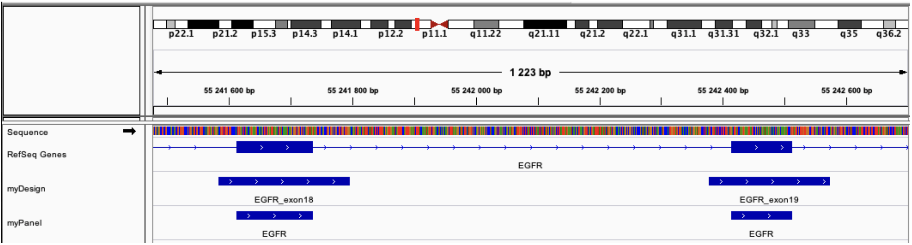

# STARK - GUIDE UTILISATEUR - version 0.9.18

## Stellar Tools from raw sequencing data Analysis to variant RanKing


- Introduction
- Prérequis
- Quick start
   - Installation
   - Utilisation
- Installation détaillée
   - Téléchargement
   - Configuration
   - Installation
   - Services
   - Répertoires
- Module STARK
   - Service CLI
   - Service API
   - Service Listener et cleaner
   - Service DAS
- Lancer une analyse
   - Données et paramètres d’entrées
   - Analyse par échantillons
   - Analyse par run
   - Résultats d’analyse
   - Rapport d’analyse
- Paramètres d’une analyse
   - Tags
   - SampleSheet
   - Applications
   - Designs, panels et transcrits de préférence
- Contact
- Annexes


# Introduction

STARK est un environnement d’analyse de données de séquençage conçu pour des données de santé (recommandations ANPGM/INCa) suivant les recommandations internationales et nationales, dont l’objectif principal est l’aide à l’interprétation des résultats en vue d’un diagnostic clinique. Flexible et adapté aux besoins des biologistes, efficient en terme de consommation de ressources, son approche « application » permet une stabilité, un suivi et une maîtrise des analyses.

STARK est constitué d’une structure principale (STARK-Core), définissant la configuration générale de l’environnement d’analyse, et d’un ensemble de modules additionnels (STARK-Modules), disponibles et administrés indépendamment. Basé sur la technologie de containérisation Docker, chaque module STARK est un ensemble de services Docker permettant de réaliser des analyses, ou mettre à disposition des interfaces. Le module principale STARK est constitué de services Docker permettant de lancer des analyses en ligne de commande (service CLI), via une interface de programmation applicative (service API), ou automatiquement par détection d’un run (service listener), permet également de mettre à disposition les données (service DAS).

STARK permet l'analyse des données de séquençage brutes, démultiplexées ou alignées (BCL, FASTQ, BAM, SAM CRAM), et génère des fichiers résultats annotés aux formats VCF et TSV (inter-opérabilité avec des interfaces de visualisation/interprétation, tableur) et des rapports (format HTML et texte, résumé des résultats, contrôle qualité, traçabilité des analyses). STARK peut analyser les données de séquençage de 2 façons différentes :

- L'analyse d'un séquençage Illumina (ou « run ») complet utilise les fichiers BCL générés par les séquenceurs et les fichiers de
    configuration (SampleSheet), ainsi que le fichier « Design » contenant les régions séquencées (Manifest).
- L'analyse d'échantillons indépendants à partir de fichiers contenant les reads séquencés (format standards FASTQ, BAM, SAM ou
    CRAM), ainsi que le fichier « Design » contenant les régions séquencées (Manifest ou bed).

Optionnellement, un fichier « Panel » contenant les régions d’intérêt et un fichier « Transcripts » contenant la liste des transcrits de préférence peuvent complimenter l’analyse.

STARK effectue les étapes de demultiplexage, d’alignement, de post alignement (marquage des duplicats, réalignement et recalibration des BAM, clipping des primers), détection de variants (calling), d'annotation et de priorisation des variants (en fonction de leur qualité, pathogénicité probable, intérêt dans la pathologie...). L'ensemble de ces étapes est effectué par une constellation d'outils de référence (e.g. bcl2fastq, FastP, GATK, Picard, Samtools, Bcftools, VarScan) et complémentaires les uns des autres, pour des analyses spécifiques (application), à chaque pathologie, technologie, type de données, pratique.

Les applications disponibles ont été développés et testés pour l'analyse des données générées par la technologie capture ou amplicon, avec les kits Illumina, Multiplicom et Agilent. Ces applications peuvent détecter les mutations (substitutions ou indels) constitutionnelles ou somatiques, les mosaïques à faible fréquence allélique.

Le code de STARK est développé sur le principe du Makefile, qui est de construire un graphe de dépendance des fichiers à générer, en définissant des règles permettant de générer ces fichiers. Ces règles constituent des briques indépendantes pouvant être utilisées pour définir des applications. Cette philosophie permet une utilisation simple du code une évolution facilité par l'ajout de règles supplémentaires.

Également, ces règles peuvent être exécutées en parallèle sur plusieurs processeurs, permettant une exécution efficiente de l’analyse en terme de ressource (scalable et distribué).

Le développement de STARK et la configuration des applications suivent les bonnes pratiques et recommandations de la communauté scientifique nationale (INCa et ANPGM) et internationales (GATK).


# Prérequis

OS : Tous systèmes permettant l’installation du service Docker (testé sur CentOS 7 et MacOS 11.x).

CPU : Au minimum 2 CPUs sont requis et idéalement 8 CPUs sont recommandés.

RAM : Au minimum 8Go de RAM par CPU et idéalement 64Go de RAM. L’application est particulièrement gourmande en mémoire lors de l’alignement des séquences par BWA et l’annotation des variants par SnpEff, en raison de la mise en mémoire du génome et des bases de données d’annotation.

STOCKAGE : Au minimum 500Go d’espace est nécessaire pour stocker les outils et les bases de données, pour créer un espace temporaire d’analyse, et accueillir un minimum de données brutes et de données résultats.

Note:
- Dimension du nombre de CPU, de la RAM et du STOCKAGE en rapport avec l’activité (nombre d’échantillons, panel de gènes,
exomes, genomes, ...).
- Des montages externes sont possibles, notamment pour les espaces des données brutes et des données résultats et d’archivage qui
augmenterons au fur et à mesure de l’activité.

# Quick start

Afin de faciliter son déploiement, l’environnement STARK est disponible en Docker, contenant les outils (binaires) et une installation automatique des bases de données nécessaires à son fonctionnement.

Les scripts permettant de construire l’environnement STARK ainsi qu’une description plus détaillée de l’installation et de la configuration sont disponibles sur GitHub (https://github.com/bioinfo-chru-strasbourg/STARK). L’environnement STARK est constitué d’une structure principale (STARK-Core) et d’un ensemble de modules additionnels (STARK-Modules). Un module STARK est un ensemble de services Docker.

Certains outils sont sous licence (e.g. GATK, ANNOVAR).

## Installation

L’installation simplifiée permet de télécharger les scripts de STARK, d’installer STARK-Core (construction des images Docker, configuration de la structure des répertoires et téléchargement des bases de données), et démarrer les services Docker du module principal STARK, par la commande suivante :

```
$ mkdir -p ${HOME}/STARK && cd ${HOME}/STARK && curl https://github.com/bioinfo-chru-strasbourg/STARK/raw/master/setup.sh | bash
```

L’installation détaillée par étapes est détaillée en dans la section Installation détaillée.

## Utilisation

La commande suivante détaille les paramètres et options de lancement d’une analyse en ligne de commande :

```
$ docker exec stark-module-stark-submodule-stark-service-cli STARK --help
```

La commande suivante permet une utilisation de l’environnement STARK en ligne de commande :

```
$ docker exec -ti stark-module-stark-submodule-stark-service-cli bash
```

Le module STARK et ses services est détaillé dans la section Module STARK.


# Installation détaillée

## Téléchargement

Création d’un répertoire d’installation STARK-bin et téléchargement des scripts STARK :

```
$ mkdir -p ${HOME}/STARK-bin
$ cd ${HOME}/STARK-bin
$ git clone https://github.com/bioinfo-chru-strasbourg/STARK.git.
```

## Configuration

La configuration de l’environnement STARK est controlé par le fichier d’environnement « .env » à la racine du répertoire d’installation. Ce fichier permet de définir les informations de création de l’image principale de STARK, des répertoires des données, et la configuration du réseau STARK associé aux différents modules et services additionnels. La configuration par défaut est adaptée à la plupart des infrastructures, seule variable du répertoire principale des données STARK-data peut être modifiée au besoin :

```
DOCKER_STARK_MAIN_FOLDER=${HOME}/STARK
```

Dans le cas d’une configuration de l’environnement à façon, les variables du fichier principale de configuration « .env » doivent correspondre aux variables utilisées dans la structure docker du fichier « docker-compose.yml ». Egalement, la configuration des services devra possiblement être adapté.

## Installation

La construction de la principale image docker de l’environnement STARK est réalisée par la commande docker-compose, ainsi que l’installation. Cette installation va créer (si nécessaire) le répertoire des données STARK-data (ce répertoire doit être précédemment créé) et les sous-répertoires, déployer les bases de données nécessaires, et archiver les sources ayant permis la création de l’environnement STARK. Le paramètre « --project-name STARK » permet d’assurer un déploiement de l’environnement dans le stack docker « stark ». Ci-dessous les commandes pas à pas :

```
$ mkdir -p $(source ${HOME}/STARK-bin/.env; echo $DOCKER_STARK_MAIN_FOLDER)
$ docker-compose build
$ docker-compose --project-name STARK up stark-setup
$ docker-compose --project-name STARK up stark-databases
$ docker-compose --project-name STARK up stark-sources-archives
```

## Services

Les services sont situés dans le dossier « STARK-bin/services » et sont organisés en modules et sous-modules (par répertoire). Chaque module contient un fichier « STARK.docker-compose.yml » décrivant les services principaux (peut être vide), le fichier « STARK.module » décrivant le module (format JSON), et le fichier « STARK.env » comprenant tous les paramètres principaux du modules, notamment pour partager les variables communes aux sous-modules. Chaque répertoire de sous-module contient les mêmes fichiers, décrivant chaque services associés et leurs paramètres. L’aide est disponible par l’option --help, les modules sont sélectionnés par l’option --modules, les sous-modules par l’option --submodules, et les services par --services. Les modules et sous-modules disponibles sont listés par l’option --modules_show. L’état des services est géré par l’option —command.

```
$ services/services.sh --help
$ services/services.sh --modules=* --command=up
$ services/services.sh --modules=* --command=down
$ services/services.sh --modules=myModule1,myModule2 --command=up
$ services/services.sh --modules=MyModule --command=up
$ services/services.sh --modules=MyModule --submodules=MySubModule --command=up
$ services/services.sh --modules=MyModule --submodules=MySubModule --services=MyService --command=up
$ services/services.sh --modules_show
```

## Répertoires

Le répertoire STARK-bin contient l’ensemble des scripts téléchargés lors de l’installation de STARK, et les fichiers de configuration de l’environnement. Ci-dessous, les principaux scripts, fichiers de configuration et sous-répertoires :

```
STARK-bin
.
├── bin               # scripts principaux de STARK
│ └── STARK           # script principal de STARK
├── config            # configuration des analyses
│ ├── apps            # configuration des applications pré-installées
│ ├── howard          # configuration par défaut de l’annotation et priorisation des variants
│ └── rules           # configuration des principales règles makefile
├── docs              # documentation
├── services          # modules additionnels
│ ├── stark           # module principal de STARK
│ ├── ...             # modules additionnels
│ ├── STARK.env       # configuration principale des modules
│ └── services.sh     # script de management des modules
├── sources           # packages et outils tiers nécessaires à l’installation
├── toolbox           # scripts supplémentaires
├── setup.sh          # script d’installation automatique
└── .env              # configuration de l’environnement de STARK
```

Le répertoire STARK-data contient la structure des sous-répertoires contenant les données d’entrées, les résultats des analyses (ou run), les bases de données, les fichiers de configurations et les log des modules. Ci-dessous, les principaux sous-répertoires :

```
STARK-data
.
├── config              # configuration des modules
│ ├── stark             # configuration du module principale de STARK
│ ├── howard            # configuration de l’annotation et priorisation des variants
│ ├── myapp             # configuration des applications additionnelles
│ └── ...               # configuration des modules additionnels (par répertoire)
├── data                # répertoire des données additionnels (structure libre)
├── databases           # ensemble des bases de données
│ ├── annovar           # collection des bases de données d’annotation des variants par ANNOVAR
│ ├── dbsnp             # base de données dbSNP
│ ├── genomes           # génomes
│ ├── refGene           # base de données refSeq et refGene
│ ├── snpeff            # collection des bases de données d’annotation des variants par snpEff
│ └── ...               # bases de données additionnelles (par répertoire)
├── input               # répertoire principal des données d’entrées
│ ├── manifests         # répertoire des designs, panels de gènes et liste de transcrips de préférence
│ └── runs              # répertoire des runs Illumina
├── output              # répertoire principal des résultats des analyses
│ ├── archives          # archivages des analyses, par groupe, projet et run
│ ├── demultiplexing    # demultiplexing des runs Illumina, par run (inactif par défaut)
│ ├── depository        # répertoire avant archivage (synchronisation nécessaire, inactif par défaut)
│ ├── repository        # répertoire de dépôt des analyses, par groupe, projet et run
│ ├── results           # répertoire des résultats des analyses, par run (inactif par défaut)
│ └── tmp               # répertoire temporaire des analyses (inactif par défaut)
├── services            # répertoire principal des modules STARK additionnels
│ ├── stark             # module principal de STARK
│ └── ...               # modules additions de STARK
└── sources             # répertoires contenant les sources de STARK (packages et outils tiers)
```

# Module STARK

Pour démarrer le module principale de STARK, composé d’un seul sous-module STARK, comprenant les services CLI (Command Line Interface), API (Application Program Interface), Listener (et son service cleaner de nettoyage), et DAS (DAta Sharing) :

```
$ services/services.sh --modules=stark --command=up
```

### Service CLI

Le service CLI (Command Line Interface) est un container Docker (stark-module-stark-submodule-stark-service-cli) qui permet d’executer des analyses personnalisées à partir des runs disponibles dans le répertoire STARK-data/input/runs, ou des données présentent dans le répertoire STARK-data/data. Par défaut, le répertoire de données STARK-data est disponible dans le container via lie montage /STARK.

Le service peut être utiliser directement en ligne de commande, en mode interactif :

```
$ docker exec -ti stark-module-stark-submodule-stark-service-cli bash
```

Ou non interactif (exemple avec l’option --help) :

```
$ docker exec stark-module-stark-submodule-stark-service-cli STARK --help
$ docker exec stark-module-stark-submodule-stark-service-cli STARK --run=myRun
$ docker exec stark-module-stark-submodule-stark-service-cli STARK --reads=/STARK/data/myData/myFastq --design=/STARK/data/myData/myDesign --application=myApplication --repository=/STARK/data/myData/myOutput
```

Egalement, les outils tiers (exemple samtools, bcftools) sont disponibles en ligne de commande :

```
$ docker exec stark-module-stark-submodule-stark-service-cli samtools
$ docker exec stark-module-stark-submodule-stark-service-cli bcftools
```

et peuvent être listés par la ligne de commande find :

```
$ docker exec stark-module-stark-submodule-stark-service-cli bash -c "find /STARK/tools -mindepth 2 -maxdepth 2 -type d"
```

## Service API

Le service API (Application Program Interface) est un container Docker (stark-module-stark-submodule-stark-service-api), dispose d’un serveur web (aide disponible), et est accessible par à l’adresse URI [http://ip:port](http://ip:port) (par défaut [http://localhost:4200).](http://localhost:4200).) Ce service est une interface permettant de mettre une command STARK en file d’attente par l’intermédiaire de paramètres au format JSON :

- [http://localhost:4200/analysis?json={"run":"myRun"}](http://localhost:4200/analysis?json={"run":"myRun"})

et de gérer la file d’attente des commandes :

- [http://localhost:4200/queue?help&format=html](http://localhost:4200/queue?help&format=html)

La file d’attente peut également être gérée par la commande curl, comme mettre une commande STARK en file d’attente :

```
$ curl [http://localhost:4200/queue?help](http://localhost:4200/queue?help)
$ curl [http://localhost:4200/queue?list](http://localhost:4200/queue?list)
$ curl -X POST -H 'Content-Type: application/json' -d '{"run":"myRun"}' [http://localhost:4200/analysis](http://localhost:4200/analysis)
```

## Service Listener et cleaner

Le service Listener est un container Docker (stark-module-stark-submodule-stark-service-listener) est exécuté en tant que démon, et permet d’écouter si de nouveaux runs ont été déposés (dans le repertoire STARK-data/input/runs), et d’envoyer une commande d’analyse au service API. Un run est considéré à analyser s’il est terminé (RTAComplete.txt), configuré avec une SampleSheet (SampleSheet.csv), et suffisamment récent (10 jours par défaut).

Le service Listener cleaner est un container Docker (stark-module-stark-submodule-stark-service-listenerclean) qui vérifie, une seule fois au démarrage ou redémarrage du service, si les runs mis en file d’attente ont bien été lancés, et les relance le cas échéant (utile après une panne ou un arrêt inopiné du serveur).


## Service DAS

Le service DAS (DAta Sharing) est un container Docker (stark-module-stark-submodule-stark-service-das), dispose d’un serveur web (aide disponible), et est accessible par à l’adresse URI [http://ip:port/publicPath/myPath](http://ip:port/publicPath/myPath) (par défaut [http://localhost:4201/static/data/public/myPath)](http://localhost:4201/static/data/public/myPath))

Ce service peut être utilisé avec des applications pouvant ouvrir des fichiers par URI (tel que IGV), ou pour partager des données entre les services des modules STARK. Par défaut, les données mises à disposition sont :

Les données bases de données :

- [http://localhost:4201/static/data/public/inputs/Input/runs](http://localhost:4201/static/data/public/inputs/Input/runs)

Les données d’entrées :

- [http://localhost:4201/static/data/public/inputs/Input/manifests](http://localhost:4201/static/data/public/inputs/Input/manifests)
- [http://localhost:4201/static/data/public/databases](http://localhost:4201/static/data/public/databases)^

Les données de sorties :

- [http://localhost:4201/static/data/public/repositories/Repository](http://localhost:4201/static/data/public/repositories/Repository)
- [http://localhost:4201/static/data/public/repositories/Archives](http://localhost:4201/static/data/public/repositories/Archives)
- [http://localhost:4201/static/data/public/data](http://localhost:4201/static/data/public/data)^


# Lancer une analyse

## Données et paramètres d’entrées

Il est possible de lancer une analyse STARK sur un ou plusieurs échantillons (FASTQ, BAM) ou directement à partir d’un run, permettant notamment une analyse complète de runs en sortie de séquenceur Illumina (BCL).

_Informations minimum requises pour lancer une analyse par échantillon ou par run Illumina_

| Fichier      | Description  |
|--------------|--------------|
| Reads        | Analyse à partir de fichiers de reads fastq, bam, sam, cram. <br>Obligatoire (analyse par échantillons)  |
| Runs         | Analyse à partir d’un répertoire de run Illumina (données brutes, démultipliées) ou contenant des fichiers de reads. <br>Obligatoire (analyse par runs)  |
| Design       | Régions séquencées (format BED ou Manifest d’Illumina). <br>Défaut: analyse sur génome complet.  |
| Application  | Ensemble des paramètres définissant une application spécifique. <br>Défaut: default.app  |
| SampleSheet  | Fichier contenant les renseignements nécessaires à la configuration d’un run Illumina, y compris la liste des échantillons. <br>Obligatoire (analyse par runs)  |


_Principaux paramètres/options disponibles_

| Parametre      | Format       | Description  |
|----------------|--------------|--------------|
| ```--analysis```     | ```<FILE1,FILE2...>```   | Liste de fichiers de paramètres/options au format JSON. <br>Format : *json {"option1":"value1", "option2":"value2"...}  |
| ```--analysis_name```     | ```<STRING>```   | Nom de l’analyse (nom du run par défaut). <br>Format : analyse  |
| ```--reads```     | ```<FILE1,FILE2...>```   | La liste des fichiers de reads FASTQ/BAM/SAM/CRAM. <br>Formats : *fastq, *fastq.gz, *bam, *sam, *cram  |
| ```--run```     | ```<FOLDER1,FOLDER2...>```   | La liste des répertoires de run à analyser. <br>Format : répertoire au format Illumina ou contenant des fichiers de reads  |
| ```--application```     | ```<STRING1,STRING2...>```   | Liste de noms de l’application ou chemins vers les fichiers application. <br>Format : application , *app  |
| ```--design```     | ```<FILE1,FILE2...>```   | Liste des fichiers de designs (régions séquencées). <br>Format : *bed, *manifest (ou autre extension)  |
| ```--genes```     | ```<FILE1,FILE2...>```   | Liste des fichiers de panel de gènes (régions d’intérêt). <br>Format : *genes  |
| ```--transcripts```     | ```<FILE1,FILE2...>```   | Liste des fichiers des transcrits de préférence. <br>Format : *transcripts  |
| ```--results```     | ```<FOLDER>```   | Répertoire contenant les résultats d’une analyse  |
| ```--help```     | ```<FILE1,FILE2...>```   | Liste des paramètres et options |


## Analyse par échantillons

L’analyse par échantillon permet de préciser les fichiers de reads à traiter (FASTQ, BAM, SAM, CRAM), ainsi que l’application à utiliser, les régions séquencées et d’intérêt, les transcrits de préférences, le répertoire de sortie des résultats.

Exemple de commande minimale :

```
$ STARK --reads=MyBam.bam --results=/path/to/My/Results/
```

Exemple de commande avec paramètres :

```
$ STARK --application=GERMLINE --analysis_name=MyAnalysis --design=MyRegions.bed --genes=MyPanel.genes
--transcripts=MyTranscripts.transcripts --results=/path/to/My/Results/
--reads=SAMPLE_A.R1.fastq.gz,SAMPLE_B.R1.fastq.gz --reads2=SAMPLE_A.R2.fastq.gz,SAMPLE_B.R2.fastq.gz
```

Note:
- Les applications disponibles sont listées par l’option --applications_infos.

## Analyse par run

L’analyse par run est conçue pour permettre de traiter un répertoire Illumina contenant les données brut (BCL) ou démultiplexées (FASTQ) directement en sortie de séquenceur, ou un répertoire contenant un ensemble des fichiers de reads (FASTQ, BAM, SAM, CRAM). Dans le cas d’un répertoire Illumina, il est nécessaire de préciser la SampleSheet ou de la déposer dans le dossier du run (https://emea.support.illumina.com).

Exemple de commande minimale (run présent dans le répertoire d’entrée input/runs):

```
$ STARK --runs=MyRun
```

Exemple de commande avec paramètres :

```
$ STARK --runs=/My/Run/folder --application=EXOME --results=/path/to/My/Results/
```

### Résultats d’analyse

Les résultats d’une analyse (ou run) sont disponibles dans les répertoires de type « repository » (par défaut archives, depository et repository), et sont organisés par groupe, projet et analyse. Ci dessous, les principaux fichiers résultats :

```
STARK-analysis
.
├── Sample1                             # répertoire des résultats de l’échantillon Sample
│ ├── Sample1.ID.stark.report.html      # rapport de l’analyse ID au format HTML
│ ├── Sample1.Panel1.genes              # panel de gènes 1
│ ├── Sample1.Panel2.genes              # panel de gènes 2
│ ├── Sample1.archive.cram              # reads bruts et alignés (pour archives)
│ ├── Sample1.*.validation.bam          # reads alignés et filtrés (pour le calcul des metrics)
│ ├── Sample1.bed                       # design des régions séquencées au format BED
│ ├── Sample1.final.Panel1.*.tsv        # liste des variants sur Panel1 au format TSV
│ ├── Sample1.final.Panel1.*.vcf.gz     # liste des variants sur Panel1 au format VCF
│ ├── Sample1.final.Panel2.*.tsv        # liste des variants sur Panel2 au format TSV
│ ├── Sample1.final.Panel2.*.vcf.gz     # liste des variants sur Panel2 au format VCF
│ ├── Sample1.full.Design.tsv           # liste des variants par caller sur Design au format TSV
│ ├── Sample1.full.Design.vcf.gz        # liste des variants par caller sur Design au format VCF
│ ├── Sample1.launch.json               # fichier de configuration pour une ré-analyse
│ ├── Sample1.manifest                  # design des régions séquencées au format Illumina
│ ├── STARK                             # répertoire contenant tous les fichiers résultats STARK
│ └── ...                               # répertoires des résultats des modules additionnels
├── Sample2                             # répertoire des résultats de l’échantillon Sample
├── ...                                 # répertoire des résultats des autres échantillons
├── analysis.ID.config                  # configuration et versions de l’analyse ID
├── analysis.ID.metrics.*               # fichiers metrics pour l’ensemble du run de l’analyse ID
└── analysis.ID.variants.*              # liste des variants de tous les échantillons (VCF, TSV)
```

## Rapport d’analyse

Un rapport d’analyse donne un aperçu des résultats générées à chaque étape de l’analyse.

L’en-tête du rapport indique l’échantillon concerné, ainsi que le nom de l’analyse (ou run), et les tags associés. Cet en-tête indique également, dans la section « Results Summary », les informations concernant l’application utilisée (non et version, description, groupe et projet), la version de STARK et des bases de données, ainsi que les informations sur le design, le(s) panel(s) de gènes et les transcrits de préférence. Un résumé des principaux indicateurs permettent également une vue global de la qualité de l’analyse (e.g. nombre de reads et de bases séquencées, score de qualité, nombre de gènes et de variants).

Plusieurs sections résumes ensuite, par des indicateurs de qualité, les résultas de l’analyse. La section « Sequencing & Mapping » détaille notamment le nombre de reads séquencés et leur qualité (rapport de qualité), alignés, et validés (filtre de qualité). La section « Targets & Genes Depth » résume les régions dont la profondeur est suffisante, ou ne passe pas les seuils de qualités. La section « Targets & Genes Coverage » résume les régions dont la couverture est suffisante, ou qui ne passe pas les seuils de qualité. La section « Variants Report » résume les variants retrouvés, en fonction de leur type. La section « Annex » détaille plus précisément les sections précédentes, notamment par des tableaux dynamiques pour faciliter la recherche de regions ou de variants.

Exemple d’en-tête de rapport d’analyse STARK


# Paramètres d’une analyse

## Tags

Le système de tag STARK est utilisées pour ajouter des méta-informations, sous forme de mots-clés, aux échantillons, ou pour paramétrer automatiquement les analyses STARK ou les modules additionnels par l’utilisation d’une SampleSheet. Les méta-informations pour les échantillons peuvent permettre l’ajout des informations importantes afin d'aider l'interprétation biologique (par exemple le type de pathologie, l’age du patient, le sexe du patient, le matériel biologique utilisé).

### Format des tags

Le format tag de STARK est le format standard d’un hashtag (composé du signe typographique « # » suivi du mot-clé, ou TAG), auquel est ajouté un TYPE en préfix (optionnel). Les tag ayant le même type peuvent être regroupés. Les tags STARK peuvent être listés en utilisant le signe typologique « ! ».

```
[TYPE]#TAG[#TAG][![TYPE]#TAG[#TAG]]
```

_Exemples des tags_

```
#cancer                                         # Tag « cancer » simple sans type
#cancer!#lymphoma!#female                       # Liste de tags simples sans type
PATHOLOGY#cancer                                # Tag « cancer » typé « PATHOLOGY »
PATHOLOGY#cancer!PATHOLOGY#lymphoma             # Tags multiple typés « PATHOLOGY »
PATHOLOGY#cancer#lymphoma                       # Tags multiple typés « PATHOLOGY » regroupés
PATHOLOGY#cancer#lymphoma!SEX#female!#blood     # Liste de tags typés et non typés
```

## SampleSheet

Une feuille d’échantillons, ou SampleSheet (Illumina), est requise pour chaque analyse par run. Ce fichier peut être déposé dans la racine du répertoire du run, avec le nom SampleSheet.csv, pour une analyse automatique, ou utilisé en mode manuel avec l’option --samplesheet.

Une SampleSheet est un fichier au format CSV (comma-separated values) qui stocke des informations nécessaires pour configurer, exécuter et analyser une analyse de séquençage. Une SampleSheet peut être créée à l'aide d'Illumina Experiment Manager (Illumina) ou manuellement à l'aide d'un éditeur de texte (Excel ou Bloc-notes). Une SampleSheet est organisé en sections.

La configuration d’un run pour une analyse STARK est réalisée par l’ajout de tags. Particulièrement, le tag APP est utilisé pour associer l’application STARK à l’ensemble du run, et/ou à chaque échantillon du run. Ainsi, l’application par défaut pour l’ensemble des échantillons du run est celle renseignée dans le champ « Description » de la section « Header ». Chaque échantillon peut être analysé avec une application spécifique en renseignant l’application dans le champ « Description » du tableau des échantillons de la section « Data ».

D’autres tags peuvent être utilisés pour configurer les modules additionnels de STARK (cf l’aide de chaque module).

_Exemple de SampleSheet_

```
[Header]                                            # Section Header
Description,APP#EXOME                               # Application EXOME par défaut pour le run
...                                                 # Autres informations de la section Header
[Data] # Section Data
Sample_ID,...,Description                           # En-tête du tableau des échantillons
SAMPLE1,...,,...                                    # Application par défaut du run
SAMPLE2,...,APP#GERMLINE,...                        # Application spécifique GERMLINE
SAMPLE3,...,APP#SOMATIC!PATHOLOGY#lymphoma,...      # Application spécifique SOMATIC
...                                                 # Autres échantillons de la section Data
```


## Applications

Une application STARK est un ensemble de variables permettant la configuration spécifique pour une analyse (exemple : petit panel de gènes par la technologie amplicon, exome par la technologie capture, identification de mutations somatiques). Les applications disponibles peuvent être listées par l’option --applications_infos. Les applications sont stockées dans le répertoire STARK-bin/config/apps sous forme de fichier ayant l’extension « .app » (format de fichier d’environnement Linux). Une application par default « default.app » est utilisées si aucune application n’est définie lors du lancement d’une analyse.

Les variables peuvent être décrites sous plusieurs sections. Ci-dessous, les principales sections et variables (cf default.app).

### Informations et description de l’application

Ces informations décrivent l’application. Notamment, les informations du groupe et du projet déterminera les sous-répertoires dans lesquels seront déposés les analyses (dans les répertoires de dépôt et d’archives).

```
APP_NAME="DEFAULT"                      # Nom de l’application
APP_RELEASE="1.1"                       # Version de l’application
APP_DESCRIPTION="Default application"   # Description de l’application
APP_GROUP=""                            # Groupe de l’application (UNKNOWN par défaut)
APP_PROJECT=""                          # Projet de l’application (UNKNOWN par défaut)
```

### Configuration principales

Les variables principales sont utilisées à plusieurs étapes de l’analyse, comme l’alignement, le calling et l’annotation.

```
ASSEMBLY=hg19                           # Assemble du génome (auto-détecté dans le manifest)
THREADS=AUTO                            # Nombre de processeur (nombre de cores - 1 par défaut)
```

### Demultiplexing et FASTQ

L’étape de demultiplexing permet d’extraire les read (FASTQ) à partir des données brutes ( BCL). Ces reads peuvent être filtrés et traités par des étapes supplémentaires..

```
BARCODE_MISMATCHES=1                    # Nombre de mismatch pour chaque read
DETECT_ADAPTER_FOR_PE=0                 # Auto-detection des adapter en paired-end
FASTQ_QUALITY_FILTERING=""              # Seuil de qualité des reads
POST_SEQUENCING_STEPS=""                # Etapes de post séquençage
```

### Pipelines et post-processing

Un pipeline est une suite d’étapes d’alignement, de calling et d’annotation (format « Aligner.Caller.Annotator »). Plusieurs pipelines peuvent être renseignés et exécutés en parallèle (format « Aligner1.Caller1.Annotator1,Aligner2.Caller2.Annotator2 »). Egalement, plusieurs étapes de post-processing permettent d’ajuster les pipelines. L’option --pipelines_infos propose l’ensemble de étapes disponibles.

```
PIPELINES="bwamem.gatkHC.howard"                                                    # Liste de pipelines
POST_ALIGNMENT_STEPS="sorting markduplicates realignment recalibration compress"    # Post alignement
POST_CALLING_STEPS="normalization recalibration filtration"                         # Post calling
POST_ANNOTATION_STEPS="sorting recalibration normalization"                         # Post annotation
```

### Annotation

Les variables d’annotation permettent de configurer les annotations, les calculs, la priorisation des variants, et les champs a afficher dans le rapport au format TCV (cf HOWARD). Ces étapes d’annotations sont réalisées pour chaque pipeline, lors de la génération du rapport en VCF (combinaison de tous les pipelines), et au niveau de l’analyse (combinaison de tous les échantillons). Ci dessous les variables d’annotation des résultats des pipelines et du rapport:

```
HOWARD_ANNOTATION="core,snpeff"                                         # Liste des annotations par type
HOWARD_CALCULATION="VARTYPE,NOMEN"                                      # Liste des calculs
HOWARD_PRIORITIZATION="default"                                         # Priorisations
HOWARD_FIELDS="NOMEN,location,outcome,snpeff_impact"                    # Champs a afficher dans le TSV
HOWARD_ANNOTATION_REPORT="core,frequency,score,prediction,snpeff"       # Liste des annotations par type
HOWARD_CALCULATION_REPORT="VAF_STATS,DP_STATS,VARTYPE,NOMEN,BARCODE"    # Liste des calculs
HOWARD_PRIORITIZATION_REPORT="default"                                  # Priorisations
HOWARD_FIELDS_REPORT=« NOMEN,location,outcome,snpeff_impact,ALL"        # Champs a afficher dans le TSV
```

### Metrics

Les metrics permettent d’évaluer notamment la qualité de séquençage et d’alignement des reads. Pour chaque échantillon et aligner), un fichier de validation (sample.aligner.validation.bam) est généré suivant les critères de qualité suivant :

```
METRICS_MINIMUM_MAPPING_QUALITY=10                  # Qualité de mapping minimum d’un read
METRICS_MINIMUM_BASE_QUALITY=10                     # Qualité de mapping minimum d’une base d’un read
CLIP_OVERLAPPING_READS=1                            # Profondeur calculée une seule fois par read paired
METRICS_FLAGS="UNMAP,SECONDARY,QCFAIL,DUP"          # Ne pas considérer les reads avec ces flags
COVERAGE_CRITERIA="1,5,10,20,30,50,100,200,300"     # Profondeurs a considérer pour la couverture
```

### Rapports

Afin de générer des indicateurs sur les metrics de qualité, certains seuils peuvent être configurés. Un seuil de profondeur est défini par le nombre de base, un seuil de couverture est défini par un pourcentage (de 0 à 1).

```
SEQUENCING_DEPTH="1"                # Seuil de profondeur de séquençage
SEQUENCING_COVERAGE_THRESHOLD="1"   # Seuil de couverture de séquençage
MINIMUM_DEPTH="30"                  # Seuil minimum de profondeur
EXPECTED_DEPTH="100"                # Seuil espéré de profondeur
DEPTH_COVERAGE_THRESHOLD="0.95"     # Seuil de couverture pour les profondeurs minimum et espérées
```

### Application additionnelle

Des applications additionnelles peuvent être configurées pour répondre aux besoins de chaque analyse. Ainsi, pour faciliter la création de nouvelles applications, le principal d’héritage permet de modifier la configuration d’une application existante en ne changeant que les variables nécessaires. A titre d’exemple, ci-dessous la configuration d’une application dédiée à la détection de mosaic et son utilisation :

```
# Heritage
source_app "GERMLINE"                               # Héritage de l’application GERMLINE

# Description de l’application
APP_NAME="myAppMosaic"                              # Nom de la nouvelle application
APP_RELEASE="1.0"                                   # Version de la nouvelle application
APP_DESCRIPTION="My App for Mosaic"                 # Description de la nouvelle application
APP_GROUP="myGroup"                                 # Groupe de la nouvelle application
APP_PROJECT="myProject"                             # Projet de la nouvelle application

# Configuration
PIPELINES=$PIPELINES" bwamem.outLyzer.howard"       # Ajout du pipeline avec le caller outLyzer
HOWARD_PRIORITIZATION="myAppPrioritization"         # Utilisation d’une priorisation configurée
COVERAGE_CRITERIA=$COVERAGE_CRITERIA",500,1000"     # Ajout de profondeurs pour les metrics
MINIMUM_DEPTH="100"                                 # Definition d’un seuil minimum de profondeur
EXPECTED_DEPTH="300"                                # Definition d’un seuil espéré de profondeur
```

_Utilisation_

```
APP#myAppMosaic                 # TAG SampleSheet avec les applications myAppMosaic
--application=myAppMosaic       # Paramètre avec les applications myAppMosaic
```

De la même manière, il est possible de définir des plugin d’application, ou plugApp. Il s’agit alors de configurer l’application sans héritage. Cette plugApp peut alors être utilisée en complément de l’application principale, soit par le paramètre --application, soit par le tag APP dans la SampleSheet. Ci-dessous, la configuration d’une plugAPP et son utilisation :

```
# Description de l’application
APP_NAME="myPlugAppMosaic"                          # Nom de la nouvelle plugApp
APP_RELEASE="1.0"                                   # Version de la nouvelle plugApp
APP_DESCRIPTION="My plugApp for Mosaic"             # Description de la nouvelle plugApp

# Configuration
PIPELINES=$PIPELINES" bwamem.outLyzer.howard"       # Ajout du pipeline avec le caller outLyzer
HOWARD_PRIORITIZATION="myAppPrioritization"         # Utilisation d’une priorisation configurée
COVERAGE_CRITERIA=$COVERAGE_CRITERIA",500,1000"     # Ajout de profondeurs pour les metrics
MINIMUM_DEPTH="100"                                 # Definition d’un seuil minimum de profondeur
EXPECTED_DEPTH="300"                                # Definition d’un seuil espéré de profondeur
```

_Utilisation_

```
APP#GERMLINE#myPlugAppMosaic                # TAG SampleSheet avec les applications GERMLINE
APP#EXOME#myPlugAppMosaic                   # TAG SampleSheet avec les applications EXOME
--application=GERMLINE,myPlugAppMosaic      # Paramètre avec les applications GERMLINE
--application=EXOME,myPlugAppMosaic         # Paramètre avec les applications EXOME
```

## Designs, panels et transcrits de préférence

Une analyse STARK prend en compte un design (régions séquencées), un panel (les régions d’intérêt, ou gènes) et les transcrits de préférence. Pour une analyse par run, les fichiers sont détectés dans le répertoire STARK-data/input/manifests.

### Design

Un design est l’ensemble des régions utilisées lors de l’étape de séquençage, généralement définies par le fournisseur du kit de séquençage, et permet de définir les régions sur lesquelles seront identifiés les variants et calculés les metrics de qualité (profondeur et couverture).

Le fichier du design peut être au format BED (.bed) ou Manifest d’Illumina (.manifest, .AmpliconManifest, ou .txt), et ce format est automatiquement détecté (par l'extension). Un seul design peut être fourni pour une analyse STARK, et un design est généré automatiquement à partir de l’alignement des reads dans le cas ou il n’est pas fourni. Seul un fichier au format Manifest permet de définir les primers dans le cas de la technologie Amplicon, contrairement à un fichier au format BED. Le fichier au format BED sera généré à partir du fichier au format Manifest le cas échéant.

Exemple de fichier au format Manifest :

```
[Header]
ReferenceGenome Homo_sapiens\UCSC\hg19\Sequence\WholeGenomeFASTA
[Regions]
Name Chromosome Start Stop Upstream Probe Length Downstream Probe Length
EGFR_exon18     chr7    55241584    55241796    29  30
EGFR_exon19     chr7    55242379    55242574    30  30
BRCA1_exon03    chr17   41267697    41267876    30  21
BRCA1_exon02    chr17   41275968    41276169    28  22
```

Exemple de fichier au format BED :

```
track name="myDesign" description="myDesign for genes EGFR and BRCA1"
chr7    55241583    55241796    EGFR_exon18     0   +
chr7    55242378    55242574    EGFR_exon19     0   +
chr17   41267696    41267876    BRCA1_exon03    0   -
chr17   41275967    41276169    BRCA1_exon02    0   -
```

### Panel

Un panel est un ensemble de régions regroupées en régions d’intérêt. Particulièrement, un panel de gènes permet de regrouper l’ensemble des exons d’un gène sous la même région d’intérêt « gène », afin notamment de calculer les metrics de qualité par gène (profondeur et couverture). Un panel est réalisé « à façon » et peut contenir n’importe quelles régions d’intérêt (e.g. exons, introns, régions inter-géniques) regroupées selon les besoin.

Le fichier de panel est au format BED et porte l’extension « .genes ». Plusieurs panels peuvent être fournis pour une analyse STARK, et un panel est généré automatiquement à partir de la base de données refGene (tous les exons et transcrits des gènes séquencés par au moins une base) dans le cas ou il n’est pas fourni. Pour une analyse par run, les panels sont détectés à partir du fichier design (d _esign_ *.genes)

Exemple de fichier au format BED :

```
track name="myPanel" description="myPanel for for genes EGFR and BRCA1"
chr7    55241613    55241736    EGFR    0   +
chr7    55242414    55242513    EGFR    0   +
chr17   41267742    41267796    BRCA1   0   -
chr17   41276033    41376132    BRCA1   0   -
```

### Transcrits de préférence

L’étape d'annotation des variants liste un ensemble d’annotation HGVS, et puis détermine un NOMEN, c’est à dire une annotation HGVS unique. La liste des transcrits de préférence permet de choisir les transcrits souhaités, pour chaque gène, parmi les annotations HGVS des variants. Si aucun transcrit n’est défini pour un gène, l’étape d’annotation choisira l’annotation HGVS selon le calcul d’un score de pertinence.

Le fichier de transcrits de préférence est au format TSV (Tabulation-Separated Values), et comporte deux colonnes : un transcrit (obligatoire) et un nom de gène (optionnel). Dans le cas de multiple transcrits de préférence pour un gène, le transcrit prioritaire est celui arrivant en premier dans la liste.

Exemple de fichier au format TSV :

```
NM_005228.3 EGFR    # transcrit EGFR principal
NM_201282.2 EGFR    # transcrit EGFR secondaire
NM_007294.3 BRCA1   # transcrit BRCA1 principal
```

_Représentation sur IGV du Design et du Panel des régions EGFR (exon 18 et exon 19) :_




# Contact

PLATEFORME BIOINFORMATIQUE

Hôpitaux Universitaires de Strasbourg (UF7363)

1, place de l’hôpital, 67091 Strasbourg

+33 3 88 12 75 38

bioinfo@chru-strasbourg.fr


# HISTORIQUE DE RÉVISION

**Date de révision Motif de la révision**

17-11-2017 Création du Document

15-06-2018 Mise à jour pour la version 0.9.16b

09-10-2018 Mise à jour pour la version 0.9.17b

12-02-2021 Mise à jour pour la version 0.9.18


# Annexes

## Répertoires de données

Ce répertoire (STARK-data) contient la structure des sous-répertoires contenant les données d’entrées, les résultats des analyses (ou run), les bases de données, les fichiers de configurations et les log des modules. Ci-dessous, les principaux sous-répertoires :

```
STARK-data
.
├── config            # configuration des modules
│ ├── stark           # configuration du module principale de STARK
│ ├── howard          # configuration de l’annotation et priorisation des variants
│ ├── myapp           # configuration des applications additionnelles
│ └── ...             # configuration des modules additionnels (par répertoire)
├── data              # répertoire des données additionnels (structure libre)
├── databases         # ensemble des bases de données
│ ├── annovar         # collection des bases de données d’annotation des variants par ANNOVAR
│ ├── dbsnp           # base de données dbSNP
│ ├── genomes         # génomes
│ ├── refGene         # base de données refSeq et refGene
│ ├── snpeff          # collection des bases de données d’annotation des variants par snpEff
│ └── ...             # bases de données additionnelles
├── input             # répertoire principal des données d’entrées
│ ├── manifests       # répertoire des designs, panels de gènes et liste de transcrits de préférence
│ └── runs            # répertoire des runs Illumina
├── output            # répertoire principal des résultats des analyses
│ ├── archives        # archivages des analyses, par groupe, projet et run
│ ├── demultiplexing  # demultiplexing des runs Illumina, par run (inactif par défaut)
│ ├── depository      # répertoire avant archivage (synchronisation nécessaire, inactif par défaut)
│ ├── repository      # répertoire de dépôt des analyses, par groupe, projet et run
│ ├── results         # répertoire des résultats des analyses, par run (inactif par défaut)
│ └── tmp             # répertoire temporaire des analyses (inactif par défaut)
├── services          # répertoire principal des modules STARK additionnels
│ ├── stark           # module principal de STARK
│ └── ...             # modules additions de STARK
└── sources           # répertoires contenant les sources de STARK (packages et outils tiers)
```

## Données d'entrées

Le répertoire _input_ regroupe les données de séquençage et les fichiers de paramètres associés.

### Données de séquençage

Répertoire regroupant les runs Illumina provenant des séquenceurs. Chaque répertoire représente un run Illumina.

```
/input/runs
```

### Designs, panels et transcrits de préférence

Répertoire regroupant les designs, panels de gènes, liste des transcrits de préférence, utilisés pour l'analyse des données séquençage

```
/input/manifests
```

### Données additionnelles

```
/data
```

## Données de résultats

Le répertoire _output_ regroupant les résultats générés par STARK

### Répertoire temporaire

Répertoire temporaire utilisé pour générer des résultats intermédiaires

```
/output/tmp
```

### Répertoire de démultiplexing

Répertoire de demultiplexing des runs, générant notamment les fichiers de reads fastq.gz pour chaque échantillon. Chaque sous répertoire correspond à un run.

```
/output/demultiplexing
```

### Répertoire de résultats

Répertoire regroupant l'ensemble des runs analysés. Chaque sous répertoire correspond à un run. Chaque répertoire de run contient des fichiers résultats propres au run (vcf, metrics, log...), et un répertoire par échantillon contenant les résultats propre à chaque échantillon (bam, vcf, tsv, metrics...)

```
/output/results
```

### Répertoire de dépôt des analyses

```
/output/repository
```

Répertoire organisant les résultats en fonction de leur groupe et projet. La structure est :

```
<GROUP>/<PROJECT>/<RUN>/<SAMPLE>
```

Pour chaque répertoire d'échantillon (_SAMPLE_), les principaux fichiers permettant l'analyse des résultats ont disponibles, et un répertoire STARK contient l'ensemble des résultats de l'échantillon. D'autres répertoires (et éventuellement d'autres fichiers principaux) contiennent les résultats des modules/services STARK éventuellement exécutés (e.g. CQI, VaRank, Pool, CANOES, DECoN...).

### Répertoire de dépôt des analyses avant archivage

```
/output/depository
```

Ce répertoire est structuré de la même manière que _/output/repository_.

Par défaut, ce répertoire est configuré comme répertoire d'archivage _/output/archives_ (désactivation de la fonction de dépôt).

En cas d'utilisation de ce répertoire de dépôt indépendamment d'un répertoire d'archivage, le processus d'archivage (synchronisation) doit être défini est mise en oeuvre indépendamment.

Ce répertoire peut être considéré comme en lecture/écriture. Les modules STARK archivant des résultats utilisent ce répertoire comme espace d'archivage.

### Répertoire de dépôt des analyses archivées

```
/output/archives
```

Ce répertoire est structuré de la même manière que _/output/repository_.

En fonction des règles d'archivage de STARK Core et STARK Modules, seulement certains fichiers seront disponibles (e.g. fichiers contenant les données brutes, principaux fichiers permettant l'analyse, fichiers de configuration permettant une ré-analyse).

Ce répertoire peut être considéré comme en lecture seule (le répertoire _/output/depository_ étant le répertoire de dépôt des résultats). Les modules STARK interrogeant l'archivage utilisent ce répertoire comme espace d'archivage.

## Configuration

Répertoire contenant l'ensemble des fichiers de configuration permettant les analyses STARK et ses modules.

```
/config
/services
/databases
```

# Configuration de STARK-Core et STARK-Modules

L'organisation des répertoires est en fonction des modules. Naturellement, chaque sous-répertoire correspond à un modules, contenant éventuellement des sous-répertoires par service (e.g. STRUCTURALVARIATION/CANOES et STRUCTURALVARIATION/DECoN).

Les modules de STARK sont disponibles sur GitHub (https://github.com/bioinfo-chru-strasbourg/STARK-modules).

Les répertoires _howard_ et _myapps_ sont communs aux analyses STARK et aux modules/services.

