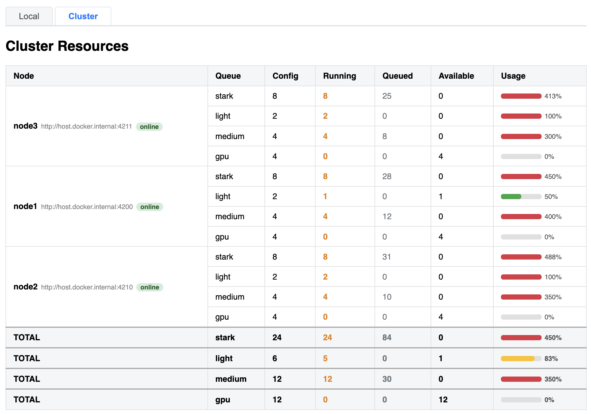
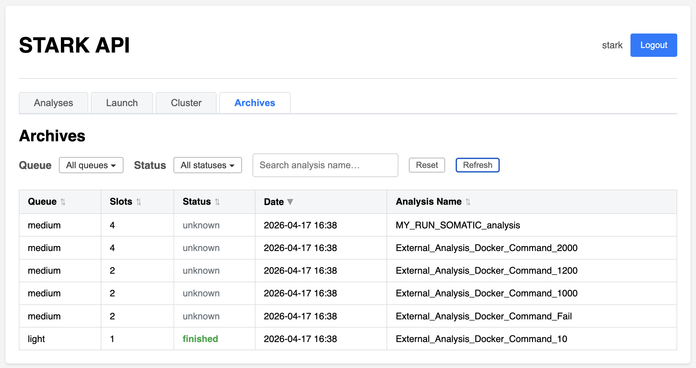

# STARKUB

A **FastAPI**-based web service for launching and monitoring [STARK](https://github.com/bioinfo-chru-strasbourg/STARK) bioinformatics analyses via a task queue ([task-spooler](https://github.com/thomaspreece/task-spooler)) and Docker.


---

## Features

- **Web UI** - browser-based dashboard to launch analyses, monitor the task queue, inspect logs and results
- **REST API** - JSON endpoints consumable by external services (e.g. `STARK.listener`)
- **Dual authentication** - JWT bearer tokens for human users + static API key (`X-API-Key`) for service-to-service calls
- **Role-based access** - `admin` group required for destructive actions (kill, remove, prioritize, relaunch) and for launching new analyses
- **Three task modes** - STARK analysis, custom Docker container command or raw shell command
- **Multiple named queues** - independent task-spooler daemons, each with its own concurrency setting, configurable via `config/queues.json`
- **Multiple node cluster** - independent nodes on multiple servers, configurable via `config/peers.json`
- **Live queue** - auto-refreshing task table (running -> queued -> finished) with per-queue context on every action
- **State colour coding** - running (orange), queued (grey), finished success (green), finished failed (red)
- **Filter bar** - combined State dropdown (Running / Queued / Finished / Failed only) and Queue multi-select dropdown; instant client-side filtering with Reset button
- **Inline detail panels** - Info / Log / Analysis JSON displayed inline, persisted across auto-refreshes, with one-click copy
- **Time tracking** - elapsed time for running tasks (computed from `Start time`), final duration for finished tasks (from `Time run`)
- **Confirmation dialogs** - danger actions (Kill, Prioritize, Remove, Relaunch) require explicit confirmation before executing
- **Visual feedback** - danger buttons show `✓ Done` / `✗ Failed` with colour flash after each action
- **Relaunch** - re-queue a finished task from its original JSON parameters on its original queue
- **Username display** - logged-in username shown next to the Logout button; group membership visible on hover

---

## Screenshots

### Analyses

Show activity, with all analyses launched in nodes and queues, with requested number of slots, state of the analysis, and available actions.  


### Launch

Launch an analysis, through STARK run name or a JSON parmeter.


### Cluster

Summary of cluster resources, with all nodes (online or offline), available queues and associated slots.



### Archives

List of archived analyses, with information about queue, requested slots and date of request.



---

## Stack

| Component | Role |
|---|---|
| FastAPI + Uvicorn | HTTP server |
| Jinja2 | HTML templating (index.html) |
| python-jose | JWT encoding/decoding |
| passlib[bcrypt] | Password hashing |
| httpx | Async HTTP client (inter-node communication) |
| task-spooler (`ts`) | Job queue daemon per queue |
| Docker | STARK analysis and command runtime |

---

## Directory layout

```bash
dockerfile/
├── app.py               # FastAPI entry point (router wiring only)
├── config.py            # All constants and environment variables
├── models.py            # Pydantic models (Token, User)
├── security.py          # Input validation (command, image, docker_extra_params)
├── authentication.py    # JWT + API key auth, user loading
├── queues.py            # task-spooler queue management
├── tasks.py             # Task build & submission logic
├── peers.py             # Cluster/orchestrator logic (peer discovery, routing, metrics)
├── requirements.txt
├── Dockerfile
├── config/
│   ├── users.json       # User database (auto-created on first run)
│   ├── queues.json      # Queue definitions (auto-created on first run)
│   └── peers.json       # Cluster peer list (auto-created on first run)
├── routers/
│   ├── auth.py          # POST /token, GET /me
│   ├── ui.py            # GET / (dashboard)
│   ├── analysis.py      # POST /analysis, POST /relaunch/{id}
│   ├── queue.py         # GET /list, GET /queue
│   └── cluster.py       # GET /whoami, /metrics, /peers, /cluster/summary, /cluster/tasks
├── static/
│   ├── script.js        # Frontend logic (Local + Cluster tabs)
│   └── style.css
└── templates/
│   └── index.html       # Dashboard template
├── images/
    ├── api.png
    └── cluster.png
README.md
```

---

## Configuration

### Environment variables

All settings are passed as **environment variables** (e.g. via `docker-compose` or a `.env` file).

| Variable | Default | Description |
|---|---|---|
| `STARK_API_KEY` | `a_default_super_secret_api_key` | Static API key for service-to-service auth (`X-API-Key` header) |
| `STARK_API_REFRESH_INTERVAL` | `10` | Queue auto-refresh interval **in seconds** |
| `DOCKER_STARK_IMAGE` | `stark` | Docker image used to run STARK analyses |
| `TS` | _(empty)_ | Path to the `ts` binary |
| `TS_SAVELIST` | `/ts-tmp` | task-spooler save directory for the **default** queue |
| `TS_SLOTS` | `1` | Number of parallel slots for the **default** queue |
| `TS_SOCKET` | _(empty)_ | TS_SOCKET path for the **default** queue (set by container) |
| `SHELL` | `/bin/ash` | Shell used to run queued commands |
| `DOCKER_STARK_SERVICE_STARK_API_CONTAINER_MOUNT` | _(empty)_ | Extra Docker volume mounts injected into all `command_docker` containers |
| `DOCKER_STARK_SERVICE_STARK_API_LOG_FOLDER` | `/STARK/services/stark/stark/api` | Folder where `.json`, `.info` and `.output` files are written |
| `DOCKER_STARK_SERVICE_STARK_API_RUNS_FOLDER` | `/STARK/input/runs` | Default folder scanned for run directories |
| `STARK_API_SELF_URL` | _(empty)_ | This node's own public URL (e.g. `http://node1:4200`). Used by the cluster orchestrator to identify which peer is self, avoid forwarding loops, and display the correct node in the cluster view. If not set, the node tries to auto-discover itself by querying each peer's `/whoami` endpoint. **Strongly recommended when using a multi-node setup.** |

Example `STARK.env`:

```env
STARK_API_KEY=my_secret_key
STARK_API_REFRESH_INTERVAL=60
TS_SLOTS=2
```

---

### Queue configuration (`config/queues.json`)

The API supports **multiple independent task queues**, each backed by a dedicated `task-spooler` daemon isolated via its own `TS_SOCKET`. Queues are defined in `config/queues.json` and auto-created from environment defaults on first start.

Each queue entry has the following fields:

| Field | Required | Description |
|---|---|---|
| `savelist` | Yes | Path to the directory where task-spooler stores output files |
| `slots` | Yes | Maximum number of tasks running in parallel in this queue |
| `socket` | No | Explicit `TS_SOCKET` path. Omitted -> auto-derived as `/tmp/ts-<name>.socket`. The **default** (first) queue never overrides `TS_SOCKET`, using the container's env value instead |
| `description` | No | Human-readable label |

**The first entry in the file is always the default queue** - used when no `"queue"` key is provided in the request body.

Example `config/queues.json`:

```json
{
  "stark": {
    "savelist": "/ts-tmp",
    "slots": 1,
    "description": "Default STARK analysis queue"
  },
  "light": {
    "savelist": "/ts-tmp-light",
    "slots": 4,
    "socket": "/tmp/ts-light.socket",
    "description": "Fast / lightweight tasks"
  },
  "medium": {
    "savelist": "/ts-tmp-medium",
    "slots": 2,
    "socket": "/tmp/ts-medium.socket",
    "description": "Medium-weight analyses"
  },
  "gpu": {
    "savelist": "/ts-tmp-gpu",
    "slots": 1,
    "socket": "/tmp/ts-gpu.socket",
    "description": "GPU-intensive tasks"
  }
}
```

**Queue isolation mechanism:**

- Each non-default queue uses a unique `TS_SOCKET` path -> its `ts` daemon is completely independent.
- `TS_SAVELIST` stores output files and does **not** isolate daemons (a common misconception).
- `TS_SLOTS` is enforced on every job submission via `ts -S <slots>` (because task-spooler only reads `TS_SLOTS` at daemon startup).
- Queues whose daemon is not yet active (no socket file) are silently skipped in list responses.
- Requesting a queue name not present in `queues.json` returns an HTTP 400 error listing available queues.

**Choosing the target queue** - add a `"queue"` key to any `/analysis` request body:

Command

```json
{ 
  "command": "sleep 10 && echo 'Hello World!'",
  "queue": "light" 
}
```

Command with Docker

```json
{
  "command_docker": "sleep 10 && echo 'Hello Wolrd! From docker...", 
  "image": "alpine", 
  "analysis_name": "cmd_docker",
  "queue": "medium"
}
```

STARK command does not need queue, the first queue is selected.

```json
{
  "run": "MY_TEST",
  "analysis_name": "MY_TEST_analysis"
}
```

If omitted, the first queue in `queues.json` is used.

---

## Cluster / Multi-node orchestration

Several STARKUB instances can be linked together into a lightweight cluster. Each node keeps its own queues and task-spooler daemons; the cluster layer adds **peer discovery**, **intelligent routing**, and **aggregated monitoring** — without any external coordinator.


### How it works

1. Each node holds a `config/peers.json` listing all known nodes (including itself, optionally).
2. When a `POST /analysis` request arrives and the node is **not** already handling a forwarded request, it collects queue metrics from all reachable peers and from itself.
3. It picks the **best peer** — the one with the most available slots for the requested queue — using the score formula:

    ```py
    score = configured_slots − running_slots − queued_slots - requested
    ```

4. If the best peer is a remote node, the request is **transparently forwarded** (`httpx`) with the `X-STARK-Forwarded: 1` header to prevent routing loops.
5. If the best peer cannot be reached, the node falls back to **local execution**.

> No external message broker, no shared database, no Kubernetes required.

---

### Peer configuration (`config/peers.json`)

Auto-created with an empty template on first start. Add one entry per node:

```json
{
  "peers": [
    { "name": "node1", "url": "http://node1:4200" },
    { "name": "node2", "url": "http://node2:4210" },
    { "name": "node3", "url": "http://node3:4211" }
  ]
}
```

- `name` — display name (used in the cluster UI)
- `url` — base URL reachable from other nodes (Docker network hostname or IP)

If the file is empty or contains no peers, the node operates in **standalone mode** and all requests are executed locally.

---

### Self-identification

Set `STARK_API_SELF_URL` in each container's environment to its own URL:

```env
# node1
STARK_API_SELF_URL=http://node1:4200

# node2
STARK_API_SELF_URL=http://node2:4210
```

This is used to:

- Exclude self from remote HTTP calls (avoids counting local tasks twice)
- Prevent infinite-forwarding loops
- Mark the correct node as "online" in the cluster summary

Without `STARK_API_SELF_URL`, the node attempts auto-discovery by probing each peer's `/whoami` endpoint and comparing hostnames (slower, less reliable).

---

### Docker Compose example (3-node cluster)

```yaml
services:
  stark-api-node1:
    image: stark-api
    ports: ["4200:4200"]
    environment:
      STARK_API_SELF_URL: http://node1:4200
      STARK_API_KEY: shared_secret
    volumes:
      - ./config:/app/config

  stark-api-node2:
    image: stark-api
    ports: ["4210:4200"]
    environment:
      STARK_API_SELF_URL: http://node2:4210
      STARK_API_KEY: shared_secret
    volumes:
      - ./config:/app/config

  stark-api-node3:
    image: stark-api
    ports: ["4211:4200"]
    environment:
      STARK_API_SELF_URL: http://node3:4211
      STARK_API_KEY: shared_secret
    volumes:
      - ./config:/app/config
```

All three nodes share the same `config/peers.json` and `config/queues.json` via the mounted volume. Any node can accept requests and route them to the least-loaded peer considered the queues.
Theses nodes can be configured separatly, especially to configure queues with differents `config/queues.json`.
Theses services can be run on multiple servers (e.g. each noe on a different server to manage a cluster).

---


Users are stored in `config/users.json` (auto-created with default accounts on first start).

```json
{
  "stark": {
    "password": "password",
    "groups": ["admin"]
  },
  "guest": {
    "password": "guest",
    "groups": []
  }
}
```

Passwords are stored in plain text in the file; **change defaults before deploying in production**.

- Users in the `admin` group can **launch**, **relaunch**, **kill**, **prioritize**, and **remove** tasks.
- Users without `admin` can only **view** the queue and display **Info / Log / Analysis** details.

---

## REST API

### Authentication

**Obtain a JWT token:**

```bash
TOKEN=$(curl -s -X POST "http://localhost:8000/token" \
  -H "Content-Type: application/x-www-form-urlencoded" \
  -d "username=stark&password=password" \
  | python3 -c "import sys,json; print(json.load(sys.stdin)['access_token'])")
```

All subsequent requests use:

```
Authorization: Bearer $TOKEN
```

Service-to-service calls use instead:

```
X-API-Key: <STARK_API_KEY>
```

---

### Endpoints summary

| Method | Path | Auth | Description |
|---|---|---|---|
| `GET` | `/` | JWT | Web dashboard |
| `POST` | `/token` | - | Obtain JWT token |
| `GET` | `/me` | JWT | Current user info |
| `POST` | `/analysis` | JWT / API-Key (admin) | Launch a task (with intelligent cluster routing) |
| `GET` | `/list` | - | List all tasks (all queues, no auth) |
| `GET` | `/queue` | JWT / API-Key | Query or act on a queue |
| `POST` | `/relaunch/{ts_id}` | JWT / API-Key (admin) | Re-queue a finished task |
| `GET` | `/whoami` | - | Returns this node's hostname (used for peer self-discovery) |
| `GET` | `/metrics` | - | Returns local queue metrics (used by peer nodes) |
| `GET` | `/peers` | - | Returns the configured peer list |
| `GET` | `/cluster/summary` | - | Aggregated resources table for all nodes |
| `GET` | `/cluster/tasks` | - | Consolidated task list from all nodes |

---

### `GET /`

Returns the web dashboard (HTML).

---

### `POST /token`

Obtain a JWT access token.

| Field | Type | Description |
|---|---|---|
| `username` | form | Username |
| `password` | form | Password |

**Response:** `{ "access_token": "...", "token_type": "bearer" }`

---

### `GET /me`

Returns the current user's username and groups.

**Response:** `{ "username": "stark", "groups": ["admin"] }`

---

### `POST /analysis`

Launch a new task. **Admin or service key only.**

The task type is determined by which key is present in the JSON body. An optional `"queue"` key routes the task to any configured queue.

| Key present | Mode | Description |
|---|---|---|
| `run` | **STARK analysis** | Runs a full STARK Docker analysis for the given run name |
| `command` | **Shell command** | Runs a raw shell command inside the API container |
| `command_docker` | **Docker command** | Runs a command in a new ephemeral Docker container |

**Common optional keys (all modes):**

| Key | Description |
|---|---|
| `analysis_name` | Human-readable task label (sanitised, max 64 chars, defaults to `UNKNOWN`) |
| `queue` | Target queue name. Must exist in `config/queues.json`. Defaults to first queue. |
| `threads` | Number of task-spooler slots (`-N`) the task should occupy. Valid range: `0` to the queue's slot count. `0` is a special value that bypasses slot accounting - the task starts immediately regardless of queue load. Absent, invalid, or out-of-range values fall back to the queue's total slot count (conservative default, prevents over-scheduling). |

**Response:** `STARK.<ID>.<analysisIDNAME>` (plain text, 200) or `KO: <reason>` (400/403).

---

#### Mode 1 - STARK analysis (`run`)

Runs the configured `DOCKER_STARK_IMAGE` Docker image for the given run directory.

```json
{
  "run": "MY_RUN",
  "analysis_name": "MY_RUN_analysis"
}
```

```bash
curl -s -X POST "http://localhost:8000/analysis" \
  -H "Authorization: Bearer $TOKEN" \
  -H "Content-Type: application/json" \
  -d '{"run": "MY_RUN", "analysis_name": "MY_RUN_analysis"}'
```

```bash
curl -s -X POST "<http://localhost:8000/analysis>" \
  -H 'Content-Type: application/json' \
  -H "X-API-Key: $STARK_API_KEY" \
  -d '{"run": "MY_RUN", "analysis_name": "MY_RUN_analysis"}' 
```

---

#### Mode 2 - Shell command (`command`)

Runs a shell command **directly inside the API container**. Has access to all mounted volumes and binaries available in the container.

```json
{
  "command": "echo hello world && sleep 2",
  "analysis_name": "test_cmd",
  "queue": "light"
}
```

```bash
curl -s -X POST "http://localhost:8000/analysis" \
  -H "Authorization: Bearer $TOKEN" \
  -H "Content-Type: application/json" \
  -d '{"command": "echo hello world", "analysis_name": "test_cmd", "queue": "light"}'
```

```bash
curl -s -X POST "<http://localhost:8000/analysis>" \
  -H 'Content-Type: application/json' \
  -H "X-API-Key: $STARK_API_KEY" \
  -d '{"command": "echo hello world", "analysis_name": "test_cmd", "queue": "light"}' 
```

> **Security:** Commands matching known destructive patterns are rejected:
> `rm -rf /`, `dd of=/dev/…`, `:(){:|:&};:` (fork bomb), `mkfs`, `> /dev/…`, etc.

---

#### Mode 3 - Docker command (`command_docker`)

Runs a command inside a **new ephemeral Docker container** (`docker run --rm`). The container receives the predefined volume mounts from `DOCKER_STARK_SERVICE_STARK_API_CONTAINER_MOUNT` and a generated `--name` for identification and cleanup.

| JSON key | Required | Description |
|---|---|---|
| `command_docker` | Yes | Command to run inside the container |
| `image` | Yes | Docker image name (e.g. `alpine`, `myregistry/myimage:1.0`) |
| `docker_extra_params` | No | Additional `docker run` flags (e.g. `-e MY_VAR=value`, `--entrypoint /bin/sh`) |
| `analysis_name` | No | Human-readable task label |
| `queue` | No | Target queue (defaults to first queue) |
| `threads` | No | Slots consumed (`-N`); see common optional keys above |

```json
{
  "command_docker": "python3 /scripts/run.py --input /data/sample.vcf",
  "image": "myregistry/mypipeline:1.0",
  "docker_extra_params": "-e MY_VAR=value",
  "analysis_name": "my_pipeline",
  "queue": "medium"
}
```

```bash
curl -s -X POST "http://localhost:8000/analysis" \
  -H "Authorization: Bearer $TOKEN" \
  -H "Content-Type: application/json" \
  -d '{"command_docker": "echo hello", "image": "alpine", "analysis_name": "test_docker", "queue": "light"}'
```

> **Security:**
>
> - `image` must match `[a-zA-Z0-9_.:/\-/@]` - shell metacharacters are rejected.
> - `docker_extra_params` is validated against a blocklist: `--privileged`, high-privilege `--cap-add` values (`SYS_ADMIN`, `SYS_PTRACE`, `NET_ADMIN`, `ALL`), `--pid host`, `--network host`, host-root mounts (`-v /:`), sensitive path mounts (`-v /etc:`, `-v /root:`, `-v /proc:`, etc.) are all rejected.

---

#### `analysis_name` sanitisation

In all modes, `analysis_name` is sanitised before use as a task label and Docker container name:

- Characters outside `[A-Za-z0-9._-]` are replaced with `_`
- Truncated to 64 characters (Docker container name limit)
- Defaults to `UNKNOWN` if absent or empty

---

### `GET /list`

Returns all tasks from all active queues. **No authentication required.**

Each task includes a `"queue"` field identifying its origin.

```bash
curl -s http://localhost:8000/list | python3 -m json.tool
```

**Response format:**

```json
[
  {
    "id": "0",
    "state": "running",
    "output": "/ts-tmp/...",
    "elevel": "",
    "times": "142.3",
    "run_name": "MY_RUN",
    "queue": "stark"
  },
  {
    "id": "1",
    "state": "queued",
    "output": "/ts-tmp-light/...",
    "elevel": "",
    "times": "",
    "run_name": "test_cmd",
    "queue": "light"
  }
]
```

> Note: task IDs are per-queue counters - ID `1` in `stark` and ID `1` in `light` are different tasks. Always use both `id` and `queue` together to identify a task.

---

### `GET /queue`

Query or act on tasks in a specific queue. The optional `queue` parameter selects the target queue (defaults to the first queue). **Authentication required.**

| Parameter | Type | Description |
|---|---|---|
| `action` | string | One of: `list`, `info`, `log`, `analysis`, `kill`, `prioritize`, `remove`, `swap` |
| `id` | string | Task ID (required for all actions except `list`) |
| `queue` | string | Queue name (optional, defaults to first queue) |

| `action` | Admin required | Description |
|---|---|---|
| `list` | No | Returns the queue as a JSON array (all queues aggregated if no `queue` param) |
| `info` | No | `ts -i <id>`: raw task-spooler task info |
| `log` | No | Contents of the `.output` log file |
| `analysis` | No | Original `.json` parameters file (pretty-printed) |
| `kill` | Yes | Stop the Docker container + `ts -k <id>` |
| `prioritize` | Yes | `ts -u <id>`: move task to front of queue |
| `remove` | Yes | `ts -r <id>`: remove task from queue |
| `swap` | Yes | `ts -U <id>`: swap with next task |

```bash
# List all queues aggregated
curl -s "http://localhost:8000/queue?action=list" \
  -H "Authorization: Bearer $TOKEN" | python3 -m json.tool

# List only the "light" queue
curl -s "http://localhost:8000/queue?action=list&queue=light" \
  -H "Authorization: Bearer $TOKEN" | python3 -m json.tool

# Get info on task 3 in the "light" queue
curl -s "http://localhost:8000/queue?action=info&id=3&queue=light" \
  -H "Authorization: Bearer $TOKEN"

# Get log of task 3 in the "stark" queue
curl -s "http://localhost:8000/queue?action=log&id=3&queue=stark" \
  -H "Authorization: Bearer $TOKEN"

# Kill task 5 in the "medium" queue
curl -s "http://localhost:8000/queue?action=kill&id=5&queue=medium" \
  -H "Authorization: Bearer $TOKEN"

# Prioritize task 2 in the default queue
curl -s "http://localhost:8000/queue?action=prioritize&id=2" \
  -H "Authorization: Bearer $TOKEN"
```

> **Important:** Always pass `&queue=<name>` when acting on a task from a non-default queue, otherwise the action targets the wrong daemon.

---

### `POST /relaunch/{ts_id}`

Re-queue a finished task using its original JSON parameters. **Admin or service key only.**

The `queue` parameter must match the queue the task originally ran in (used to find the correct `ts` daemon and retrieve the `.json` file).

| Parameter | Type | Description |
|---|---|---|
| `ts_id` | path | Task ID to relaunch |
| `queue` | query | Queue the task belongs to (optional, defaults to first queue) |

```bash
# Relaunch task 3 from the default queue
curl -s -X POST "http://localhost:8000/relaunch/3" \
  -H "Authorization: Bearer $TOKEN"

# Relaunch task 7 from the "light" queue
curl -s -X POST "http://localhost:8000/relaunch/7?queue=light" \
  -H "Authorization: Bearer $TOKEN"
```

**Response:** `STARK.<new_ID>.<analysisIDNAME>` (plain text, 200).

The relaunched task is re-submitted to the same queue as the original (queue information is read from the original JSON file's `queue` field if present).

---

## Web UI

The dashboard is accessible at `http://localhost:8000/`.

| Section | Description |
|---|---|
| **Header** | STARKUB title, logged-in username (hover for groups), Logout button |
| **Launch Analysis** | Run name field + Advanced JSON textarea. Visible to admins only. |
| **Filter bar** | State dropdown (Running / Queued / Finished + **Failed only**) and Queue multi-select dropdown. Filters are client-side and instant. A **✕ Reset** button restores all defaults. |
| **Task Queue** | Auto-refreshing table. Tasks sorted: running -> queued -> finished. |

The dashboard has two top-level tabs:

- **Local** — the standard task queue for this node (filter bar, task table, inline panels)
- **Cluster** — aggregated view across all nodes (see below)

### Local tab

**Queue table columns:** ID, State, Queue, E-Level, Time, Analysis Name, Actions.

**State colour coding:**

| State | Colour |
|---|---|
| `running` | Orange |
| `queued` | Grey |
| `finished` (success) | Green |
| `finished` (failed) | Red |

**Action buttons per state:**

| State | Buttons |
|---|---|
| `running` | I (Info), L (Log), A (Analysis), **K (Kill)** |
| `queued` | I (Info), L (Log), A (Analysis), **P (Prioritize)**, **X (Remove)** |
| `finished` | I (Info), L (Log), A (Analysis), **R (Relaunch)** |

Red buttons (K, P, X, R) are only visible to `admin` users and require a confirmation dialog before executing. After the action completes, the button briefly shows `✓ Done` (green) or `✗ Failed` (red) before restoring its label.

Clicking **I**, **L**, or **A** opens an inline detail panel below the row. The panel persists across auto-refreshes and includes a **Copy** button. Panels from tasks in different queues with the same numeric ID are tracked independently.

**Filter bar - State dropdown options:**

| Option | Effect |
|---|---|
| Running | Show/hide running tasks |
| Queued | Show/hide queued tasks |
| Finished | Show/hide all finished tasks |
| ─── | |
| Failed only | Show **only** finished tasks with a non-zero exit code (overrides other filters) |

### Cluster tab


Displays aggregated information from all nodes defined in `config/peers.json`.

**Cluster Resources table** — one row per (node × queue). Columns: Node, Queue, Config, Running, Queued, Available, Usage.

- The **Usage** bar is colour-coded: green (< 70%), yellow (≥ 70%), red (≥ 100%).
- Offline nodes (unreachable) are shown with a red `offline` badge and empty metric cells.
- A **TOTAL** row aggregates each queue across all online nodes.

**Cluster Tasks table** — all running and queued tasks from all nodes. Includes a **Node** column to identify the origin. The table auto-refreshes on the same interval as the Local tab.

---

### Cluster endpoints

#### `GET /whoami`

Returns this node's hostname. Used by peers during self-discovery when `STARK_API_SELF_URL` is not set.

**Response:** `{ "id": "node1" }`

---

#### `GET /metrics`

Returns the local queue metrics. Called by other nodes to compute routing scores.

**Response:**

```json
{
  "stark": { "configured": 8, "running": 0, "queued": 0, "available": 8 },
  "light": { "configured": 2, "running": 2, "queued": 11, "available": 0 }
}
```

---

#### `GET /peers`

Returns the list of configured peers from `config/peers.json`.

**Response:** `{ "peers": [{ "name": "node1", "url": "http://node1:4200" }, ...] }`

---

#### `GET /cluster/summary`

Aggregates queue metrics from all reachable nodes and returns a single object with per-node details and cluster-wide totals.

**Response:**

```json
{
  "nodes": [
    {
      "name": "node1",
      "url": "http://node1:4200",
      "status": "online",
      "queues": {
        "light": { "configured": 2, "running": 2, "queued": 11, "available": 0 }
      }
    },
    {
      "name": "node2",
      "url": "http://node2:4210",
      "status": "offline",
      "queues": {}
    }
  ],
  "totals": {
    "light": { "configured": 4, "running": 4, "queued": 22, "available": 0 }
  }
}
```

Offline nodes (unreachable within 1 second) appear with `"status": "offline"` and empty queues.

---

#### `GET /cluster/tasks`

Returns a consolidated task list from all reachable nodes. Each task is enriched with `node` and `node_url` fields to identify its origin.

```bash
curl -s http://localhost:4200/cluster/tasks | python3 -m json.tool
```

---

## Security notes

| Concern | Mitigation |
|---|---|
| Credential exposure | Passwords in `config/users.json` should be changed from defaults before deployment |
| JWT secret | Set a strong `SECRET_KEY` env var; default is an insecure placeholder |
| API key | Change `STARK_API_KEY` from its default before deployment |
| Shell injection (`command`) | Blocklist of dangerous patterns; runs inside the container, not on the host |
| Shell injection (`command_docker`) | `image` character whitelist; `docker_extra_params` privilege-escalation blocklist |
| Queue enumeration | Unknown queue names return an explicit 400 with the list of valid queues |
| Privilege escalation | `--privileged`, `--cap-add SYS_ADMIN`, host path mounts are blocked in `command_docker` |
