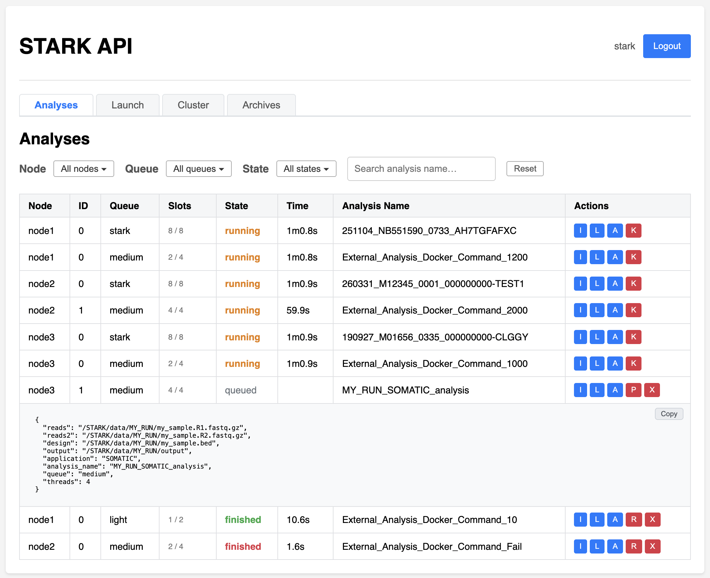
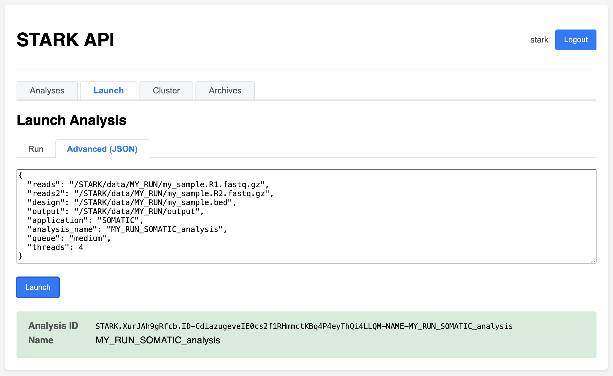
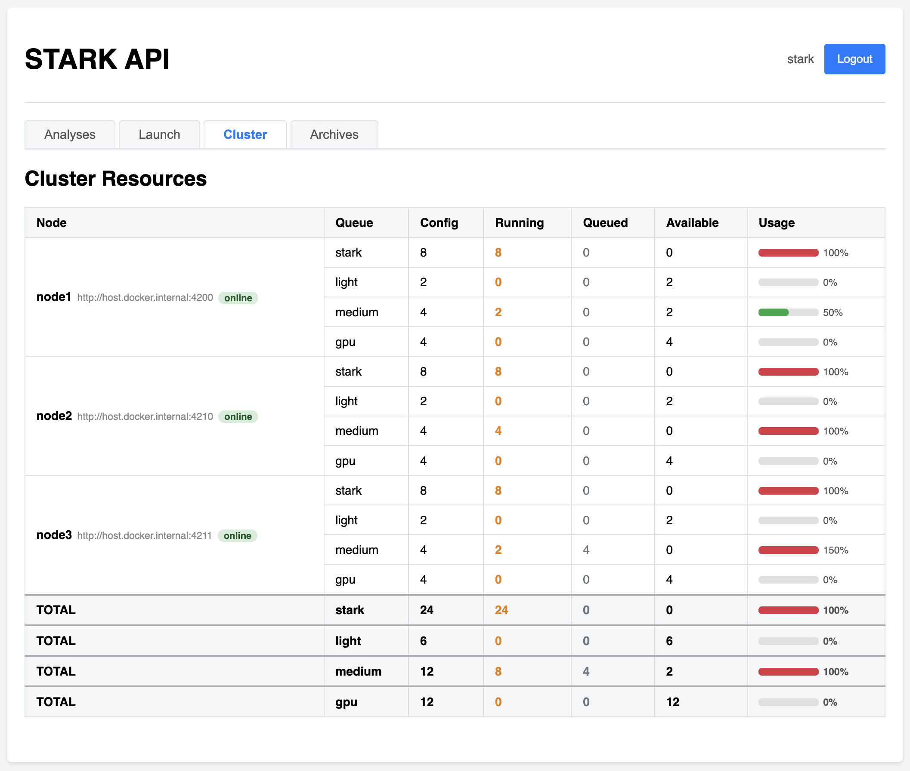
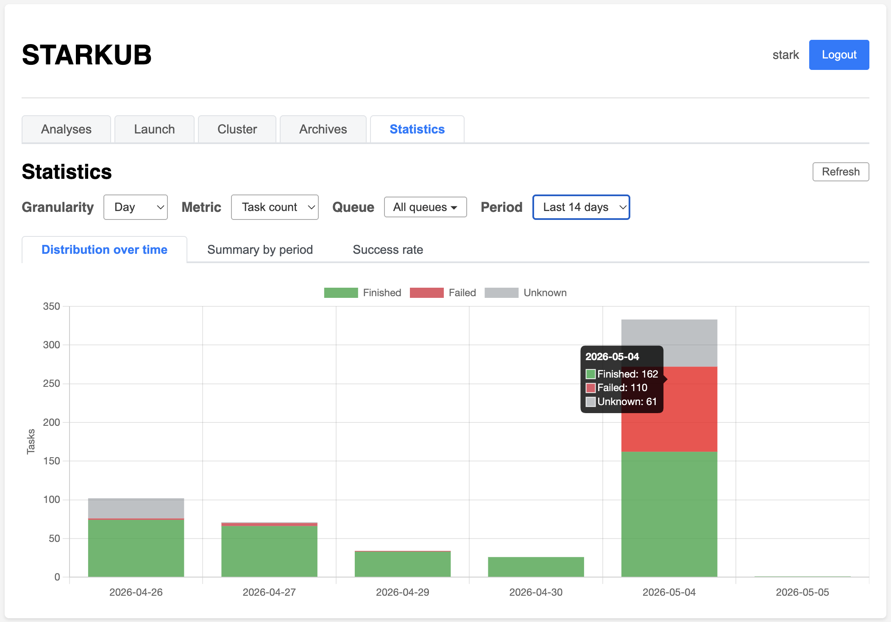

# STARKUB

A **FastAPI**-based web service for launching and monitoring [STARK](https://github.com/bioinfo-chru-strasbourg/STARK) bioinformatics analyses via a task queue ([task-spooler](https://github.com/thomaspreece/task-spooler)) and Docker.

---

## Features

- **Web UI** - browser-based dashboard to launch analyses, monitor the task queue, inspect logs and results
- **REST API** - JSON endpoints consumable by external services (e.g. listeners)
- **Dual authentication** - JWT bearer tokens for human users + static API key (`X-API-Key`) for service-to-service calls
- **Role-based access** - `admin` group required for destructive or modification actions (kill, remove, prioritize, relaunch) and for launching new analyses
- **Module-based analysis** - server-side module registry (`config/modules.json`) maps named modules to Docker images with per-module defaults
- **Five task modes** - STARK analysis, module CLI (`module`), Docker run (`image`), Docker exec (`container`), or Docker Compose (`service`)
- **Multiple named queues** - independent task-spooler daemons, each with its own concurrency setting, configurable via `config/queues.json`
- **Multiple node cluster** - independent nodes on multiple servers, configurable via `config/nodes.json`
- **Resources** - tasks are defined with a number of threads (corresponding to slots requested) and memory limit (for docker container)
- **Live queue** - auto-refreshing task table (running -> queued -> finished) with per-node and per-queue context on every action
- **State colour coding** - running (orange), queued (grey), finished success (green), finished failed (red)
- **Filter bar** - combined State dropdown (Running / Queued / Finished / Failed only), and Node and Queue multi-select dropdown (and with Reset button)
- **Inline detail panels** - Info / Log / Analysis JSON displayed, persisted across auto-refreshes, with one-click copy
- **Time tracking** - elapsed time for running tasks, final duration for finished tasks
- **Confirmation dialogs** - danger actions (Kill, Prioritize, Remove, Relaunch) require explicit confirmation before executing
- **Visual feedback** - danger buttons show `Done` / `Failed` with colour flash after each action
- **Relaunch** - re-queue a finished task from its original JSON parameters on its original queue (but different node possible)
- **Prioritize** - re-queue a queued task and prioritize it from its original JSON parameters on its original queue (but different node possible)
- **Username display** - logged-in username shown next to the Logout button; group membership visible on hover
- **Cluster monitoring** - cluster resources dashboard, showing usage and running, queued and available queues on online nodes
- **Archives** - list of previous analyses stored as configuration files (not in live spooler), with status, date, queue and requested slots
- **Statistics** - graphical dashboard built from archive data: task distribution over time (bar chart), per-period summary table, and overall success-rate donut chart, with granularity, date-range and queue filters

---

## Web UI

The dashboard is accessible at `http://server:8000/`, for any nodes.

The dashboard has five top-level tabs:

- **Analyses** - Show activity, with all analyses launched in nodes and queues, with requested number of slots, state of the analysis, and available actions.
- **Launch** - Launch an analysis, through STARK run name or a JSON parameter.
- **Cluster** - Summary of cluster resources, with all nodes (online or offline), available queues and associated slots.
- **Archives** - List of archived analyses, with information about queue, requested slots and date of request.
- **Statistics** - Graphical statistics computed from archived analyses: distribution over time, summary by period, and success rate.

### Analysis tab

Displays an aggregation of all tasks from all nodes defined in `config/nodes.json`.



**State colour coding:**

| State | Colour |
| --- | --- |
| `running` | Orange |
| `queued` | Grey |
| `finished` | Green |
| `failed` | Red |

**Action buttons per state:**

| State | Buttons |
| --- | --- |
| `running` | I (Info), L (Log), A (Analysis), **K (Kill)** |
| `queued` | I (Info), L (Log), A (Analysis), **P (Prioritize)**, **X (Remove)** |
| `finished` | I (Info), L (Log), A (Analysis), **R (Relaunch)** |

Red buttons (K, P, X, R) are only visible to `admin` users and require a confirmation dialog before executing. After the action completes, the button briefly shows `Done` (green) or `Failed` (red) before restoring its label.

Clicking **I**, **L**, or **A** opens an modal detail panel. The panel persists across auto-refreshes and includes a **Copy** button. Panels from tasks in different queues with the same numeric ID are tracked independently.

**Filter bar - State dropdown options:**

Tasks can be filtered by Node, Queue or States. A search bar filter on analysis name. A reset button remove all filters.

Filters on states:

| Option | Effect |
| --- | --- |
| Running | Show/hide running tasks |
| Queued | Show/hide queued tasks |
| Finished | Show/hide all finished tasks |
| Failed | Show/hide all failed tasks |

### Launch tab

Provides four sub-tabs to launch an analysis.



| Sub-tab | Description |
| --- | --- |
| **STARK Run** | Submit a run name directly to the default STARK module |
| **STARK Analysis** | Submit a CLI command to a configured module (see [Module configuration](#module-configuration-configmodulesjson)) |
| **Docker Command** | Run an arbitrary command in a custom Docker container |
| **Advanced (JSON)** | Send a raw JSON payload to `POST /analysis` |

Response shows the analysis ID and name (available in the Analyses tab), with green colour on success, red on failure (with reason, e.g. `Unknown module 'FOO'. Available: STARK`).

### Cluster tab

Displays aggregated information from all nodes defined in `config/nodes.json`.



**Cluster Resources table** - one row per (node x queue). Columns: Node, Queue, Config, Running, Queued, Available, Usage.

- The **Usage** bar is colour-coded: green (< 70%), yellow (≥ 70%), red (≥ 100%).
- Offline nodes (unreachable) are shown with a red `offline` badge and empty metric cells.
- A **TOTAL** row aggregates each queue across all online nodes.

### Archives tab

Show a list of previous analyses.


For each analysis, information are provided:

- **Queue**: original queue requested
- **Slots**: number of slot used
- **Status**: whether the analysis is still processing (`unknown`), finished (`finished`) or failed (`failed`)
- **Date**: Date of the request (when the analysis had been requested, not start running)
- **Analysis Name**: Name of the analysis

Analyses can be filtered by Queue or Status. A search bar filter on analysis name. A reset button remove all filters, and a refresh button refresh the list.

**Status colour coding:**

| State | Colour |
| --- | --- |
| `unknown` | Grey |
| `finished` | Green |
| `failed` | Red |

### Statistics tab

Displays statistics computed from the full archive of analyses.



The tab is divided into three sub-tabs:

- **Distribution over time** - Stacked bar chart showing the number of tasks (or slots used) per period, broken down by status (`finished` in green, `failed` in red, `unknown` in grey).
- **Summary by period** - Table with one row per period: finished, failed, unknown counts, total, and success rate badge (green ≥ 80 %, orange ≥ 50 %, red < 50 %). A **TOTAL** row aggregates all periods.
- **Success rate** - Donut chart with the overall `finished / total` ratio displayed at the centre, colour-coded by threshold (green ≥ 80 %, orange ≥ 50 %, red < 50 %).

**Filters:**

| Filter | Description |
| --- | --- |
| **Granularity** | Group periods by `Day`, `Month` (default) or `Year` |
| **Metric** | Count by number of `Tasks` (default) or `Slots used` |
| **Queue** | Multi-select dropdown - visible when more than one queue is present |
| **Period** | Pre-defined ranges that adapt to the selected granularity (e.g. Last 30 days / Last 12 months / Last 3 years), plus a **Custom…** option exposing free `From` / `To` date inputs |

**Pre-defined ranges by granularity:**

| Granularity | Available presets |
| --- | --- |
| `Year` | Last 3 years, Last 5 years, Last 10 years, All |
| `Month` | Last 3 months, Last 6 months, Last 12 months, Last 24 months, All |
| `Day` | Last 7 days, Last 14 days, Last 30 days, Last 90 days, All |

> **Note:** when the number of periods exceeds 90, a warning banner is displayed advising to switch to a coarser granularity or to narrow the date range, to avoid an unreadable chart.

Data is loaded from `/cluster/archives` (same endpoint as the Archives tab). If the Archives tab has already been visited in the session, the data is reused without a second request.

---

## Stack

| Component | Role |
| --- | --- |
| FastAPI + Uvicorn | HTTP server |
| Jinja2 | HTML templating (index.html) |
| python-jose | JWT encoding/decoding |
| passlib[bcrypt] | Password hashing |
| httpx | Async HTTP client (inter-node communication) |
| task-spooler (`ts`) | Job queue daemon per queue |
| Docker | STARK analysis and Docker container command runtime |
| Docker Compose | Docker compose command runtime |

---

## Directory layout

```bash
app/
├── app.py               # FastAPI entry point (router wiring only)
├── authentication.py    # JWT + API key auth, user loading
├── config.py            # All constants and environment variables
├── models.py            # Pydantic models (Token, User)
├── nodes.py             # Cluster/orchestrator logic (node discovery, routing, metrics)
├── queues.py            # task-spooler queue management
├── security.py          # Input validation (command, image, docker_extra_params)
├── modules.py           # Module registry loader and resolver
├── tasks.py             # Task build & submission logic
├── config/
│   ├── modules.json     # Module registry (auto-created on first run)
│   ├── nodes.json       # Cluster node list (auto-created on first run)
│   ├── queues.json      # Queue definitions (auto-created on first run)
│   └── users.json       # User database (auto-created on first run)
├── routers/
│   ├── analysis.py      # POST /analysis, POST /relaunch/{id}
│   ├── auth.py          # POST /token, GET /me
│   ├── cluster.py       # GET /whoami, /metrics, /nodes, /modules, /queues, /cluster/summary, /cluster/tasks
│   ├── queue.py         # GET /list, GET /queue
│   └── ui.py            # GET / (dashboard)
├── static/
│   ├── favicon.ico      # Icon
│   ├── chart.umd.min.js # Chart.js bundle used by the dashboard
│   ├── script.js        # Frontend logic (Local + Cluster + Statistics tabs)
│   └── style.css        # CSS
├── templates/
│   └── index.html       # Dashboard template
└── images/
    ├── api.png
    ├── analyses.png
    ├── archives.png
    ├── cluster.png
    └── launch.png
Dockerfile
LICENSE
README.md
requirements.txt
```

---

## Configuration

### Environment variables

All settings are passed as **environment variables** (e.g. via `docker-compose` or a `.env` file).

| Variable | Default | Description |
| --- | --- | --- |
| `STARK_API_KEY` | `a_default_super_secret_api_key` | Static API key for service-to-service auth (`X-API-Key` header) |
| `STARK_API_REFRESH_INTERVAL` | `10` | Queue auto-refresh interval **in seconds** |
| `STARK_API_LAUNCH_ENABLED` | `true` | Show (`true`) or hide (`false`) the Launch tab for all users, including admins |
| `STARK_API_LAUNCH_MODES` | `run,analysis,docker,advanced` | Comma-separated list of allowed Launch sub-tabs. Accepted values: `run`, `analysis`, `docker`, `advanced`. Unknown values are silently ignored. If the result is empty, all four are re-enabled as a safety fallback |
| `DOCKER_STARK_IMAGE` | `stark` | Docker image used to run STARK analyses |
| `TS` | _(empty)_ | Path to the `ts` binary |
| `TS_SAVELIST` | `/ts-tmp` | task-spooler save directory for the **default** queue |
| `TS_SLOTS` | (max core) | Number of parallel slots for the **default** queue |
| `TS_SOCKET` | _(empty)_ | TS_SOCKET path for the **default** queue (set by container) |
| `SHELL` | `/bin/ash` | Shell used to run queued commands |
| `DOCKER_STARK_SERVICE_STARK_API_CONTAINER_MOUNT` | _(empty)_ | Extra Docker volume mounts injected into `docker run` and `docker-compose run` containers (when `use_stark_container_mount` is `true`) |
| `DOCKER_STARK_SERVICE_STARK_API_LOG_FOLDER` | `/STARK/services/stark/stark/api` | Folder where `.json`, `.info` and `.output` files are written |
| `DOCKER_STARK_SERVICE_STARK_API_RUNS_FOLDER` | `/STARK/input/runs` | Default folder scanned for run directories |
| `STARK_API_SELF_URL` | _(empty)_ | This node's own public URL (e.g. `http://node1:4200`). Used by the cluster orchestrator to identify which peer is self, avoid forwarding loops, and display the correct node in the cluster view. If not set, the node tries to auto-discover itself by querying each peer's `/whoami` endpoint. **Strongly recommended when using a multi-node setup.** |

Example `STARK.env`:

```bash
STARK_API_KEY=my_secret_key
STARK_API_REFRESH_INTERVAL=60
TS_SLOTS=2
```

Example of `docker-compose.yml`:

```yml
    # STARK API
    starkub:
        image: starkub:1.0
        build:
            context: ./dockerfile
            dockerfile: Dockerfile
        container_name: starkub
        restart: always
        env_file:
            - STARK.env
        environment:
            # Task Spooler parameters
            - TS=ts
            - TS_SAVELIST=/ts-tmp
            # Shell
            - SHELL=/bin/bash
            # Docker STARK image
            - DOCKER_STARK_IMAGE=stark/stark:19.0.0
            # Docker STARK container mount parameters - databases config data input repository archives services
            - DOCKER_STARK_SERVICE_STARK_API_CONTAINER_MOUNT=-v /var/run/docker.sock:/var/run/docker.sock -v /home/stark/STARK/databases:/STARK/databases:ro -v /home/stark/STARK/config/myapps:/STARK/config/myapps:ro -v /home/stark/STARK/config/howard:/STARK/config/howard:ro -v /home/stark/STARK/data:/STARK/data:rw -v /home/stark/STARK/input/runs:/STARK/input/runs:ro -v /home/stark/STARK/input/manifests:/STARK/input/manifests:ro -v /home/stark/STARK/input/pedigree:/STARK/input/pedigree:ro -v /home/stark/STARK/output/repository:/STARK/output/repository:rw -v /home/stark/STARK/output/archives:/STARK/output/archives:rw -v /home/stark/STARK/output/favorites:/STARK/output/favorites:rw -v /home/stark/STARK/services/stark/stark/api:/STARK/services/stark/stark/api -v /STARK/output/results -v /STARK/output/demultiplexing
            # Inner log folder (default "/STARK/services/stark/stark/api")
            - DOCKER_STARK_SERVICE_STARK_API_LOG_FOLDER=/STARK/services/stark/stark/api
            # Inner runs folder (default "/STARK/input/runs")
            - DOCKER_STARK_SERVICE_STARK_API_RUNS_FOLDER=/STARK/input/runs 
        ports:
            - 4200:8000
        volumes:
            # Docker sock
            - /var/run/docker.sock:/var/run/docker.sock
            # Main configuration
            - /home/stark/STARK/config/stark/stark:/STARK/config/stark/stark:ro
            # User configuration
            - /home/stark/STARK/config/stark/stark/api:/STARK/config/stark/stark/api:rw
            # User services
            - /home/stark/STARK/services/stark/stark/api:/STARK/services/stark/stark/api:rw
            # Task spooler
            - /home/stark/STARK/services/stark/stark/api:/ts-tmp:rw
            # Inner runs folder
            - /Users/lebechea/STARK/input/runs:/STARK/input/runs:ro
        healthcheck:
            test: "curl -f http://0.0.0.0:8000 || exit 1"
            interval: 60s
            timeout: 10s
            retries: 3
```

### Module configuration (`config/modules.json`)

Modules are named Docker-image profiles used by the **STARK Analysis** launch sub-tab and the `POST /analysis` endpoint (with a `command` key). They are defined in `config/modules.json` and auto-created with a built-in `STARK` default on first start.

Each module entry has the following fields:

| Field | Required | Description |
| --- | --- | --- |
| `_description` | No | Human-readable label shown in the UI |
| `_enable` | No | Define if module is available and can be used |
| `_available` | No | Define if module is available in interface |
| `image` | Yes | Docker image to run (e.g. `stark/stark:19.0.0`) |
| `docker_extra_params` | No | Extra `docker run` flags injected for this module (e.g. `--shm-size=4g`) |
| `use_stark_container_mount` | No | Whether to append the STARK volume mounts (default `true`) |
| `defaults` | No | Default values for `queue`, `threads`, `memory`, `prioritize` pre-filled in the UI |

Example `config/modules.json`:

```json
{
  "STARK": {
    "_description": "Default STARK analysis module",
    "_enable": true,
    "_available": true,
    "image": "stark/stark:19.0.0",
    "docker_extra_params": "",
    "use_stark_container_mount": true,
    "defaults": {
      "queue": "stark",
      "threads": 8,
      "memory": null,
      "prioritize": false
    }
  },
  "HOWARD": {
    "_description": "HOWARD annotation pipeline",
    "_enable": true,
    "_available": true,
    "image": "bioinfochrustrasbourg/howard:0.9.18.0",
    "docker_extra_params": "--shm-size=4g",
    "use_stark_container_mount": false,
    "defaults": {
      "queue": "light",
      "threads": 4,
      "memory": "8G",
      "prioritize": false
    }
  }
}
```

**How modules work:**

- Module names are upper-cased (lookup is case-insensitive).
- The `command` field sent to `POST /analysis` is always forwarded as **direct CLI args** to the container: `docker run <image> <command>`.
- If `module` is absent from the request, the server falls back to the first configured module. If `module` is provided but empty or unknown, the server returns HTTP 400 listing available modules.
- The `GET /modules` endpoint exposes `name`, `description`, and `defaults` for each module (image is not exposed for security).

---

### Queue configuration (`config/queues.json`)

The API supports **multiple independent task queues**, each backed by a dedicated `task-spooler` daemon isolated via its own `TS_SOCKET`. Queues are defined in `config/queues.json` and auto-created from environment defaults on first start.

Each queue entry has the following fields:

| Field | Required | Description |
| --- | --- | --- |
| `savelist` | Yes | Path to the directory where task-spooler stores output files |
| `slots` | Yes | Maximum number of tasks running in parallel in this queue |
| `socket` | No | Explicit `TS_SOCKET` path. Omitted -> auto-derived as `/tmp/ts-<name>.socket`. The **default** (first) queue never overrides `TS_SOCKET`, using the container's env value instead |
| `description` | No | Human-readable label |

**The first entry in the file is always the default queue** - used when no `"queue"` key is provided in the request body.

Example `config/queues.json`:

```json
{
  "stark": {
    "savelist": "/ts-tmp",
    "slots": 1,
    "description": "Default STARK analysis queue"
  },
  "light": {
    "savelist": "/ts-tmp-light",
    "slots": 4,
    "socket": "/tmp/ts-light.socket",
    "description": "Fast / lightweight tasks"
  },
  "medium": {
    "savelist": "/ts-tmp-medium",
    "slots": 2,
    "socket": "/tmp/ts-medium.socket",
    "description": "Medium-weight analyses"
  },
  "gpu": {
    "savelist": "/ts-tmp-gpu",
    "slots": 1,
    "socket": "/tmp/ts-gpu.socket",
    "description": "GPU-intensive tasks"
  }
}
```

**Queue isolation mechanism:**

- Each non-default queue uses a unique `TS_SOCKET` path -> its `ts` daemon is completely independent.
- `TS_SAVELIST` stores output files and does **not** isolate daemons (a common misconception).
- `TS_SLOTS` is enforced on every job submission via `ts -S <slots>` (because task-spooler only reads `TS_SLOTS` at daemon startup).
- Queues whose daemon is not yet active (no socket file) are silently skipped in list responses.
- Requesting a queue name not present in `queues.json` returns an HTTP 400 error listing available queues.

**Choosing the target queue** - add a `"queue"` key to any `/analysis` request body:

Command with Docker:

```json
{
  "command": "sh -c 'sleep 10 && echo Hello World'",
  "image": "alpine",
  "analysis_name": "cmd_docker",
  "queue": "medium"
}
```

STARK command does not need queue, the first queue is selected.

```json
{
  "run": "MY_TEST",
  "analysis_name": "MY_TEST_analysis"
}
```

If omitted, the first queue in `queues.json` is used.

---

## Cluster / Multi-node orchestration

Several STARKUB instances can be linked together into a lightweight cluster. Each node keeps its own queues and task-spooler daemons; the cluster layer adds **node discovery**, **intelligent routing**, and **aggregated monitoring** - without any external coordinator.


### How it works

1. Each node holds a `config/nodes.json` listing all known nodes (including itself).
2. When a `POST /analysis` request arrives and the node is **not** already handling a forwarded request, it collects queue metrics from all reachable nodes and from itself.
3. It picks the **best node** using the prioritize method:

    - calculate delta as overload distance: `delta = available - requested`
    - First classify nodes by capability: can this node satisfy the request (delta >= 0) or not (delta < 0)?
    - Among capable nodes, prefer those that are not overloaded (delta >= 0) over those that are overload (delta < 0).
    - Then minimize overload (negative delta) or waste (positive delta).
    - Penalize overload more heavily than waste by making it a primary sorting key.

4. If the best node is a remote node, the request is **transparently forwarded** (`httpx`) with the `X-STARK-Forwarded: 1` header to prevent routing loops.
5. If the best node cannot be reached, the node falls back to **local execution**.
6. Number of threads is adjusted if the queue can not reach the request number (i.e. threads = max(slots) for the queue if threads > max(slots))

> No external message broker, no shared database, no Kubernetes required.

### Node configuration (`config/nodes.json`)

Auto-created with an empty template on first start. Add one entry per node:

```json
{
  "nodes": [
    { "name": "node1", "url": "http://node1:4200" },
    { "name": "node2", "url": "http://node2:4210" },
    { "name": "node3", "url": "http://node3:4211" }
  ]
}
```

- `name` - display name (used in the cluster UI)
- `url` - base URL reachable from other nodes (Docker network hostname or IP)

Nodes can be deployed on same server, with different port (see `docker-compose.yml`)

```json
{
  "nodes": [
    { "name": "server1-node1", "url": "http://server1:4200" },
    { "name": "server2-node1", "url": "http://server2:4200" },
    { "name": "server2-node2", "url": "http://server2:4201" }
  ]
}
```

If the file is empty or contains no nodes, the node operates in **standalone mode** and all requests are executed locally.

### Self-identification

Set `STARK_API_SELF_URL` in each container's environment to its own URL:

```bash
# node1
STARK_API_SELF_URL=http://node1:4200
```

```bash
# node2
STARK_API_SELF_URL=http://node2:4210
```

This is used to:

- Exclude self from remote HTTP calls (avoids counting local tasks twice)
- Prevent infinite-forwarding loops
- Mark the correct node as "online" in the cluster summary

Without `STARK_API_SELF_URL`, the node attempts auto-discovery by probing each node's `/whoami` endpoint and comparing hostnames (slower, less reliable).

### Docker Compose example (3-nodes on same server)

```yaml
services:
  starkub-node1:
    image: starkub
    ports: ["4200:8000"]
    environment:
      STARK_API_SELF_URL: http://server:4200
      STARK_API_KEY: shared_secret
    volumes:
      - ./config:/app/config

  starkub-node2:
    image: starkub
    ports: ["4210:8000"]
    environment:
      STARK_API_SELF_URL: http://server:4210
      STARK_API_KEY: shared_secret
    volumes:
      - ./config:/app/config

  starkub-node3:
    image: starkub
    ports: ["4211:8000"]
    environment:
      STARK_API_SELF_URL: http://server:4211
      STARK_API_KEY: shared_secret
    volumes:
      - ./config:/app/config
```

All three nodes share the same `config/nodes.json` and `config/queues.json` via the mounted volume. Any node can accept requests and route them to the least-loaded node considered the queues.

These nodes can be configured separately, especially to configure queues with different `queues.json` (e.g. `config/node1/queues.json`, `config/node2/queues.json`, `config/node3/queues.json`).

These services can be run on multiple servers (e.g. each node on a different server to manage a cluster). This configuration to launch docker compose in each server.

Example of multi-server and multi-nodes configuration, with common nodes and users configuration:

```yaml
# Server1
services:
  starkub-node1:
    image: starkub
    ports: ["4200:8000"]
    environment:
      STARK_API_SELF_URL: http://server:4200
      STARK_API_KEY: shared_secret
    volumes:
      - ./config/nodes.json:/app/config/nodes.json
      - ./config/users.json:/app/config/users.json
      - ./config/server1/node1/queues.json:/app/config/queues.json
```

On server2:

```yaml
services:
  starkub-node1:
    image: starkub
    ports: ["4200:8000"]
    environment:
      STARK_API_SELF_URL: http://server:4200
      STARK_API_KEY: shared_secret
    volumes:
      - ./config/nodes.json:/app/config/nodes.json
      - ./config/users.json:/app/config/users.json
      - ./config/server2/node1/queues.json:/app/config/queues.json

  starkub-node2:
    image: starkub
    ports: ["4210:8000"]
    environment:
      STARK_API_SELF_URL: http://server:4201
      STARK_API_KEY: shared_secret
    volumes:
      - ./config/nodes.json:/app/config/nodes.json
      - ./config/users.json:/app/config/users.json
      - ./config/server2/node2/queues.json:/app/config/queues.json
```

### Users configuration

Users are stored in `config/users.json` (auto-created with default accounts on first start).

```json
{
  "stark": {
    "password": "password",
    "groups": ["admin"]
  },
  "guest": {
    "password": "guest",
    "groups": []
  }
}
```

Passwords are stored in plain text in the file; **change defaults before deploying in production**.

- Users in the `admin` group can **launch**, **relaunch**, **kill**, **prioritize**, and **remove** tasks.
- Users without `admin` can only **view** the queue and display **Info / Log / Analysis** details.

---

## REST API

### Authentication

**Obtain a JWT token:**

```bash
TOKEN=$(curl -s -X POST "http://localhost:8000/token" \
  -H "Content-Type: application/x-www-form-urlencoded" \
  -d "username=stark&password=password" \
  | python3 -c "import sys,json; print(json.load(sys.stdin)['access_token'])")
```

All subsequent requests use:

```text
Authorization: Bearer $TOKEN
```

Service-to-service calls use instead:

```text
X-API-Key: <STARK_API_KEY>
```

### Endpoints summary

| Method | Path | Auth | Description |
| --- | --- | --- | --- |
| `GET` | `/` | JWT | Web dashboard |
| `POST` | `/token` | - | Obtain JWT token |
| `GET` | `/me` | JWT | Current user info |
| `POST` | `/analysis` | JWT / API-Key (admin) | Launch a task — dispatch by context key: `container` (exec), `service` (compose), `image` (run), `module` (CLI), else STARK analysis; cluster-routed |
| `GET` | `/modules` | JWT / API-Key | List configured modules with their defaults |
| `GET` | `/queues` | JWT / API-Key | List configured queue names |
| `GET` | `/list` | - | List all tasks (all queues, no auth) |
| `GET` | `/queue` | JWT / API-Key | Query or act on a queue |
| `POST` | `/relaunch/{ts_id}` | JWT / API-Key (admin) | Re-queue a finished task |
| `GET` | `/whoami` | - | Returns this node's hostname (used for node self-discovery) |
| `GET` | `/metrics` | - | Returns local queue metrics (used by other nodes) |
| `GET` | `/nodes` | - | Returns the configured node list |
| `GET` | `/cluster/summary` | - | Aggregated resources table for all nodes |
| `GET` | `/cluster/tasks` | - | Consolidated task list from all nodes |
| `GET` | `/cluster/archives` | - | Consolidated task list from archived configured files |

### `GET /`

Returns the web dashboard (HTML).

### `POST /token`

Obtain a JWT access token.

| Field | Type | Description |
| --- | --- | --- |
| `username` | form | Username |
| `password` | form | Password |

**Response:** `{ "access_token": "...", "token_type": "bearer" }`

### `GET /me`

Returns the current user's username and groups.

**Response:** `{ "username": "stark", "groups": ["admin"] }`

### `POST /analysis`

Launch a new task. **Admin or service key only.**

The task mode is determined by which **context key** is present in the JSON body. The command to execute is always passed in the `"command"` key. An optional `"queue"` key routes the task to any configured queue.

| Context key | Mode | Description |
| --- | --- | --- |
| `module` | **Module CLI** | Runs `command` as direct CLI args to the configured module container (image resolved server-side) |
| `image` | **Docker run** | Runs `command` in a new ephemeral Docker container via `docker run` |
| `service` | **Docker compose** | Runs `command` via `docker-compose run` (requires `docker_compose_file`) |
| `container` | **Docker exec** | Runs `command` inside an already-running container via `docker exec` |
| `endpoint` | **RPC** or **API** | Runs `command` as parameters for an external application endpoint |
| _(none)_ | **STARK analysis** | Runs a full STARK Docker analysis — use `run` key or full JSON params |

**Common optional keys (all modes):**

| Key | Description |
| --- | --- |
| `analysis_name` | Human-readable task label (sanitised, max 64 chars, defaults to `UNKNOWN`) |
| `queue` | Target queue name. Must exist in at least one `queues.json` of a node. Defaults to first queue. |
| `threads` | Number of task-spooler slots (`-N`) the task should occupy. Valid range: `1` to the queue's slot count. Absent, invalid, or out-of-range values fall back to the queue's total slot count (conservative default, prevents over-scheduling). |
| `memory` | Amount of memory requested for the task, for the docker container. |
| `prioritize` | Prioritize task once it is launched. |

**Response:** `STARK.<ID>.<analysisIDNAME>` (plain text, 200) or `Launch failed: <reason>` (plain text, 400), `Relaunch failed: <reason>` (plain text, 500), authentication failure (JSON, 403).

#### Mode 0 - Module CLI (`module` + `command`)

Runs `command` as **direct CLI args** in the module container:

```bash
docker run <image> <command>
```

The module image and extra Docker parameters are resolved server-side from `config/modules.json`. Sending the `module` key in the request selects this mode; without it, the request is treated as a STARK JSON analysis.

| JSON key | Required | Description |
| --- | --- | --- |
| `module` | Yes* | Context key that selects Module CLI mode. Module name (case-insensitive); empty or `null` defaults to the first configured module; unknown name -> HTTP 400. |
| `command` | Yes | CLI argument JSON or string passed directly to the container (e.g. `{"run": "MY_RUN", "sample_filter": "Sample1"}` or `--run=MY_RUN --sample_filter=Sample1`) |
| `analysis_name` | No | Human-readable task label |
| `queue` | No | Target queue (defaults to first queue) |
| `threads` | No | Slots consumed (`-N`); see common optional keys above |
| `memory` | No | Memory limit for the Docker container |
| `prioritize` | No | Prioritize task once it is launched |

Example:

```json
{
  "module": "STARK",
  "command": "--run=MY_RUN --sample_filter=Sample1,Sample2",
  "queue": "stark",
  "threads": 8
}
```

Example with curl:

```bash
curl -s -X POST "http://localhost:8000/analysis" \
  -H "Authorization: Bearer $TOKEN" \
  -H "Content-Type: application/json" \
  -d '{"module": "STARK", "command": "--run=MY_RUN", "queue": "stark"}'
```

#### Mode 1 - STARK analysis (`run`)

Runs the configured `DOCKER_STARK_IMAGE` Docker image for the given run directory. See STARK parameters for more information about how to launch a STARK analysis.

Extended parameters can control STARK analysis and docker container.

| JSON key | Required | Description |
| --- | --- | --- |
| `analysis_name` | No | Human-readable task label |
| `docker_extra_params` | No | Additional `docker run` flags (e.g. `-e MY_VAR=value`, `--entrypoint /bin/sh`) |
| `queue` | No | Target queue (defaults to first queue) |
| `threads` | No | Slots consumed (`-N`); see common optional keys above |
| `memory` | No | Memory limit for docker container |
| `prioritize` | No | Prioritize task once it is launched |

Example of standard RUN analysis:

```json
{
  "run": "MY_RUN"
}
```

Example of RUN analysis with specific resources:

```json
{
  "run": "MY_RUN",
  "threads": 8,
  "memory": "32G"
}
```

Example of a RUN analysis with more parameters (run folder is in `${HOME}/data/external_runs`):

```json
{
  "run": "/STARK/input/external_runs/MY_RUN",
  "analysis_name": "MY_RUN_analysis",
  "docker_extra_params": " -e PARAM1=value1 -v ${HOME}/data/external_runs:/STARK/input/external_runs ",
  "queue": "stark",
  "threads": 8,
  "memory": "32G"
}
```

Examples of request with curl (using token or API key):

```bash
curl -s -X POST "http://localhost:8000/analysis" \
  -H "Authorization: Bearer $TOKEN" \
  -H "Content-Type: application/json" \
  -d '{"run": "MY_RUN", "analysis_name": "MY_RUN_analysis"}'
```

```bash
curl -s -X POST "<http://localhost:8000/analysis>" \
  -H 'Content-Type: application/json' \
  -H "X-API-Key: $STARK_API_KEY" \
  -d '{"run": "MY_RUN", "analysis_name": "MY_RUN_analysis"}' 
```

#### Mode 2 - Docker run (`image` + `command`)

Runs `command` inside a **new ephemeral Docker container** (`docker run --rm`). The container receives the predefined volume mounts from `DOCKER_STARK_SERVICE_STARK_API_CONTAINER_MOUNT` when `use_stark_container_mount` is `true`, and a generated `--name` for identification and cleanup.

| JSON key | Required | Description |
| --- | --- | --- |
| `image` | Yes | Docker image name (e.g. `alpine`, `myregistry/myimage:1.0`) — context key that selects this mode |
| `command` | Yes | CLI argument JSON or string passed directly to the container (e.g. `{"run": "MY_RUN", "sample_filter": "Sample1"}` or `--run=MY_RUN --sample_filter=Sample1`) |
| `docker_extra_params` | No | Additional `docker run` flags (e.g. `-e MY_VAR=value`, `--entrypoint /bin/sh`) |
| `use_stark_container_mount` | No | Append the STARK volume mounts (default `false`) |
| `analysis_name` | No | Human-readable task label |
| `queue` | No | Target queue (defaults to first queue) |
| `threads` | No | Slots consumed (`-N`) and `--cpus` limit; see common optional keys above |
| `memory` | No | Docker memory limit (e.g. `4G`) |
| `prioritize` | No | Prioritize task once it is launched |

Example:

```json
{
  "image": "myregistry/mypipeline:1.0",
  "command": "python3 /scripts/run.py --input /data/sample.vcf",
  "docker_extra_params": "-v ${HOME}/data:/data/ -e MY_VAR=value",
  "use_stark_container_mount": false,
  "analysis_name": "my_pipeline",
  "queue": "medium",
  "threads": 2,
  "memory": "4G"
}
```

Example with entrypoint and command in JSON:

```json
{
  "image": "myregistry/mypipeline:1.0",
  "command": {"input": "/data/sample.vcf"},
  "docker_extra_params": "-v ${HOME}/data:/data/ -e MY_VAR=value --entrypoint=/scripts/run.py",
  "use_stark_container_mount": false,
  "analysis_name": "my_pipeline",
  "queue": "medium",
  "threads": 2,
  "memory": "4G"
}
```

Example with STARK volumes automatically mounted:

```json
{
  "image": "myregistry/mypipeline:1.0",
  "command": "python3 /scripts/run.py --input /STARK/data/sample.vcf",
  "docker_extra_params": "-e MY_VAR=value",
  "use_stark_container_mount": true,
  "analysis_name": "my_pipeline",
  "queue": "stark",
  "threads": 4,
  "memory": "12G"
}
```

Example with curl:

```bash
curl -s -X POST "http://localhost:8000/analysis" \
  -H "Authorization: Bearer $TOKEN" \
  -H "Content-Type: application/json" \
  -d '{"image": "alpine", "command": "echo hello", "analysis_name": "test_docker", "queue": "light"}'
```

> **Security:**
>
> - `image` must match `[a-zA-Z0-9_.:/\-/@]` — shell metacharacters are rejected.
> - `docker_extra_params` is validated against a blocklist: `--privileged`, high-privilege `--cap-add` values (`SYS_ADMIN`, `SYS_PTRACE`, `NET_ADMIN`, `ALL`), `--pid host`, `--network host`, host-root mounts (`-v /:`), sensitive path mounts (`-v /etc:`, `-v /root:`, `-v /proc:`, etc.) are all rejected.
>
> **Note:**
>
> - `threads` sets both the task-spooler slot count and the Docker `--cpus` limit. To constrain memory, use the `memory` key or `--memory` within `docker_extra_params`.

#### Mode 3 - Docker compose (`service` + `command`)

Runs `command` via **`docker-compose run --rm`** using the specified service and compose file. A generated `--name` is used for identification and cleanup.

| JSON key | Required | Description |
| --- | --- | --- |
| `service` | Yes | Docker Compose service name — context key that selects this mode |
| `docker_compose_file` | Yes | Path to the docker-compose YAML file (e.g. `docker-compose.yml`) |
| `command` | Yes | CLI argument JSON or string passed directly to the container (e.g. `{"run": "MY_RUN", "sample_filter": "Sample1"}` or `--run=MY_RUN --sample_filter=Sample1`) |
| `docker_extra_params` | No | Additional `docker-compose run` flags (e.g. `-e MY_VAR=value`, `--entrypoint /bin/sh`) |
| `use_stark_container_mount` | No | Append the STARK volume mounts (default `false`) |
| `analysis_name` | No | Human-readable task label |
| `queue` | No | Target queue (defaults to first queue) |
| `threads` | No | Slots consumed (`-N`); see common optional keys above |

Example:

```json
{
  "service": "my_service",
  "docker_compose_file": "docker-compose.yml",
  "command": "python3 /scripts/run.py --input /data/sample.vcf",
  "docker_extra_params": "-e MY_VAR=value",
  "analysis_name": "my_pipeline",
  "queue": "medium"
}
```

Example with curl:

```bash
curl -s -X POST "http://localhost:8000/analysis" \
  -H "Authorization: Bearer $TOKEN" \
  -H "Content-Type: application/json" \
  -d '{"service": "my_service", "docker_compose_file": "docker-compose.yml", "command": "echo hello", "analysis_name": "test_docker", "queue": "light"}'
```

> **Security:**
>
> - `docker_extra_params` is validated against a blocklist: `--privileged`, high-privilege `--cap-add` values (`SYS_ADMIN`, `SYS_PTRACE`, `NET_ADMIN`, `ALL`), `--pid host`, `--network host`, host-root mounts (`-v /:`), sensitive path mounts (`-v /etc:`, `-v /root:`, `-v /proc:`, etc.) are all rejected.
>
> **Note:**
>
> - `threads` sets the task-spooler slot count but does **not** constrain container resources (Docker Compose does not accept `--cpus`). Define resource limits directly in `docker-compose.yml` (e.g. `cpus` and `memory` under `deploy.resources`).

#### Mode 4 - Docker exec (`container` + `command`)

Runs `command` inside an **already-running container** via `docker exec`. The target container is not stopped on completion; only the exec process is killed on TERM/INT.

This mode is useful for sending a command to a long-running service container without spawning a new container.

| JSON key | Required | Description |
| --- | --- | --- |
| `container` | Yes | Name or ID of an already-running container — context key that selects this mode |
| `command` | Yes | CLI argument JSON or string passed directly to the container (e.g. `{"run": "MY_RUN", "sample_filter": "Sample1"}` or `--run=MY_RUN --sample_filter=Sample1`) |
| `docker_extra_params` | No | Extra `docker exec` flags (e.g. `-e VAR=val`, `-w /workdir`, `-u user`) |
| `analysis_name` | No | Human-readable task label |
| `queue` | No | Target queue (defaults to first queue) |
| `threads` | No | Slots consumed (`-N`); see common optional keys above |
| `prioritize` | No | Prioritize task once it is launched |

Example:

```json
{
  "container": "stark_cli",
  "command": "--run=MY_RUN --sample_filter=Sample1",
  "analysis_name": "MY_RUN_exec",
  "queue": "stark",
  "threads": 4
}
```

Example with commadn in JSON:

```json
{
  "container": "stark_cli",
  "command": {"run": "MY_RUN", "sample_filter": "Sample1"},
  "analysis_name": "MY_RUN_exec",
  "queue": "stark",
  "threads": 4
}
```

Example with curl:

```bash
curl -s -X POST "http://localhost:8000/analysis" \
  -H "Authorization: Bearer $TOKEN" \
  -H "Content-Type: application/json" \
  -d '{"container": "stark_cli", "command": "echo hello", "analysis_name": "test_exec"}'
```

> **Security:**
>
> - `container` must match `[a-zA-Z0-9][a-zA-Z0-9_.\-]*` — other characters are rejected.
> - `docker_extra_params` is validated against the same blocklist as other modes.
>
> **Note:**
>
> - `docker exec` does not support `--cpus` or `--memory`; those resource flags are ignored. Thread count only affects the task-spooler slot count (`-N`).
> - The target container must already be running when the task is dequeued. If it is stopped in the meantime, the exec will fail.

#### Mode 5 - Endpoint (`endpoint` + `command`)

Runs `command` requesting an **endpoint** as URL (such as RPC or API-REST).

This mode is useful for sending a command to a external application.

| JSON key | Required | Description |
| --- | --- | --- |
| `endpoint` | Yes | URL of the RPC or API-REST application |
| `command` | Yes | Parameters to send to the endpoint, in JSON |
| `api_key_variable` | No | API KEY for security, if needed |
| `bearer_token_variable` | No | TOKEN for security, if needed |
| `analysis_name` | No | Human-readable task label |
| `queue` | No | Target queue (defaults to first queue) |
| `threads` | No | Slots consumed (`-N`); see common optional keys above |
| `memory` | No | Docker memory limit (e.g. `4G`) |
| `prioritize` | No | Prioritize task once it is launched |

Example with RPC application (with named parameters):

```json
{
  "endpoint": "http://192.168.1.130:5001/rpc",
  "command": {"method": "my_analysis", "params": {"run": "MY_RUN", "sample_filter": "Sample1", "param1": [1,5,10,100]}, "id": "MY_APPLICATION_RPC", "jsonrpc": "2.0"},
  "api_key_variable": "RPC_API_KEY",
  "analysis_name": "MY_APPLICATION_RPC",
  "queue": "stark",
  "threads": 4
}
```

Example with RPC application:

```json
{
  "endpoint": "http://192.168.1.130:5001/rpc",
  "command": {"method": "my_analysis", "params": ["MY_RUN", "Sample1", [1,5,10,100]], "id": "MY_APPLICATION_RPC", "jsonrpc": "2.0"},
  "api_key_variable": "RPC_API_KEY",
  "analysis_name": "MY_APPLICATION_RPC",
  "queue": "stark",
  "threads": 4
}
```

Example for API-REST application:

```json
{
  "endpoint": "http://192.168.1.130:5002/analysis",
  "command": {"run": "MY_RUN", "sample_filter": "Sample1", "param2": [1,5,10,100], "id": "MY_APPLICATION_API"},
  "api_key_variable": "APP_API_KEY",
  "analysis_name": "MY_APPLICATION_API",
  "queue": "stark",
  "threads": 4
}
```

Example with curl:

```bash
curl -s -X POST "http://localhost:8000/analysis" \
  -H "Authorization: Bearer $TOKEN" \
  -H "Content-Type: application/json" \
  -d '{"endpoint": "http://192.168.1.130:5001/rpc", "command": {"method": "my_analysis", "params": ["MY_RUN", "Sample1", [1,5,10,100]], "id": "MY_APPLICATION_RPC", "jsonrpc": "2.0"}, "api_key_variable": "RPC_API_KEY", "analysis_name": "MY_APPLICATION_RPC"}'
```

> **Security:**
>
> - `api_key_variable` and `bearer_token_variable` are variable names that are configured as a system variable on external application.
>
> **Note:**
>
> - External application as endpoint does not support `--threads` or `--memory`; those resource flags are ignored. Thread count only affects the task-spooler slot count (`-N`).
> - The external application must already be running.
> - For RPC application, "id" is required in command JSON parameters. JSON RPC version is an option (e.g. `"jsonrpc": "2.0"`), but needed if params as a dict (named parameters)
> - For RPC with params as dict (named parameters), keywords `threads` and `memory` are re-injected depending on queue resources (only if keywords exists in command)

#### `analysis_name` sanitisation

In all modes, `analysis_name` is sanitised before use as a task label and Docker container name:

- Characters outside `[A-Za-z0-9._-]` are replaced with `_`
- Truncated to 64 characters (Docker container name limit)
- Defaults to `UNKNOWN` if absent or empty

### `GET /queues`

Returns the list of configured queue names from `config/queues.json`.

**Response:** `{ "queues": ["stark", "light", "medium"] }`

### `GET /modules`

Returns the list of configured modules from `config/modules.json`. Image names are not exposed.

**Response:**

```json
{
  "modules": [
    {
      "name": "STARK",
      "description": "Default STARK analysis module",
      "defaults": { "queue": "stark", "threads": 8, "memory": null, "prioritize": false }
    }
  ]
}
```

### `GET /list`

Returns all tasks from all active queues. **No authentication required.**

Each task includes a `"queue"` field identifying its origin.

```bash
curl -s http://localhost:8000/list | python3 -m json.tool
```

**Response format:**

```json
[
  {
    "id": "0",
    "state": "running",
    "output": "/ts-tmp/...",
    "elevel": "",
    "times": "142.3",
    "run_name": "MY_RUN",
    "queue": "stark"
  },
  {
    "id": "1",
    "state": "queued",
    "output": "/ts-tmp-light/...",
    "elevel": "",
    "times": "",
    "run_name": "test_cmd",
    "queue": "light"
  }
]
```

> Note: task IDs are per-queue counters - ID `1` in `stark` and ID `1` in `light` are different tasks. Always use both `id` and `queue` together to identify a task.

### `GET /queue`

Query or act on tasks in a specific queue. The optional `queue` parameter selects the target queue (defaults to the first queue). **Authentication required.**

| Parameter | Type | Description |
| --- | --- | --- |
| `action` | string | One of: `list`, `info`, `log`, `analysis`, `kill`, `prioritize`, `remove`, `swap` |
| `id` | string | Task ID (required for all actions except `list`) |
| `queue` | string | Queue name (optional, defaults to first queue) |

| `action` | Admin required | Description |
| --- | --- | --- |
| `list` | No | Returns the queue as a JSON array (all queues aggregated if no `queue` param) |
| `info` | No | `ts -i <id>`: raw task-spooler task info |
| `log` | No | Contents of the `.output` log file |
| `analysis` | No | Original `.json` parameters file (pretty-printed) |
| `kill` | Yes | Stop the Docker container + `ts -k <id>` |
| `prioritize` | Yes | `ts -u <id>`: move task to front of queue |
| `remove` | Yes | `ts -r <id>`: remove task from queue |
| `swap` | Yes | `ts -U <id>`: swap with next task |

```bash
# List all queues aggregated
curl -s "http://localhost:8000/queue?action=list" \
  -H "Authorization: Bearer $TOKEN" | python3 -m json.tool

# List only the "light" queue
curl -s "http://localhost:8000/queue?action=list&queue=light" \
  -H "Authorization: Bearer $TOKEN" | python3 -m json.tool

# Get info on task 3 in the "light" queue
curl -s "http://localhost:8000/queue?action=info&id=3&queue=light" \
  -H "Authorization: Bearer $TOKEN"

# Get log of task 3 in the "stark" queue
curl -s "http://localhost:8000/queue?action=log&id=3&queue=stark" \
  -H "Authorization: Bearer $TOKEN"

# Kill task 5 in the "medium" queue
curl -s "http://localhost:8000/queue?action=kill&id=5&queue=medium" \
  -H "Authorization: Bearer $TOKEN"

# Prioritize task 2 in the default queue
curl -s "http://localhost:8000/queue?action=prioritize&id=2" \
  -H "Authorization: Bearer $TOKEN"
```

> **Important:** Always pass `&queue=<name>` when acting on a task from a non-default queue, otherwise the action targets the wrong daemon.

### `POST /relaunch/{ts_id}`

Re-queue a finished task using its original JSON parameters. **Admin or service key only.**

The `queue` parameter must match the queue the task originally ran in (used to find the correct `ts` daemon and retrieve the `.json` file).

| Parameter | Type | Description |
| --- | --- | --- |
| `ts_id` | path | Task ID to relaunch |
| `queue` | query | Queue the task belongs to (optional, defaults to first queue) |

```bash
# Relaunch task 3 from the default queue
curl -s -X POST "http://localhost:8000/relaunch/3" \
  -H "Authorization: Bearer $TOKEN"

# Relaunch task 7 from the "light" queue
curl -s -X POST "http://localhost:8000/relaunch/7?queue=light" \
  -H "Authorization: Bearer $TOKEN"
```

**Response:** `STARK.<new_ID>.<analysisIDNAME>` (plain text, 200).

The relaunched task is re-submitted to the same queue as the original (queue information is read from the original JSON file's `queue` field if present).

### `GET /whoami`

Returns this node's hostname. Used by nodes during self-discovery when `STARK_API_SELF_URL` is not set.

**Response:** `{ "id": "node1" }`

### `GET /metrics`

Returns the local queue metrics. Called by other nodes to compute routing scores.

**Response:**

```json
{
  "stark": { "configured": 8, "running": 0, "queued": 0, "available": 8 },
  "light": { "configured": 2, "running": 2, "queued": 11, "available": 0 }
}
```

### `GET /nodes`

Returns the list of configured nodes from `config/nodes.json`.

**Response:** `{ "nodes": [{ "name": "node1", "url": "http://node1:4200" }, ...] }`

### `GET /cluster/summary`

Aggregates queue metrics from all reachable nodes and returns a single object with per-node details and cluster-wide totals.

**Response:**

```json
{
  "nodes": [
    {
      "name": "node1",
      "url": "http://node1:4200",
      "status": "online",
      "queues": {
        "light": { "configured": 2, "running": 2, "queued": 11, "available": 0 }
      }
    },
    {
      "name": "node2",
      "url": "http://node2:4210",
      "status": "offline",
      "queues": {}
    }
  ],
  "totals": {
    "light": { "configured": 4, "running": 4, "queued": 22, "available": 0 }
  }
}
```

Offline nodes (unreachable within 1 second) appear with `"status": "offline"` and empty queues.

### `GET /cluster/tasks`

Returns a consolidated task list from all reachable nodes. Each task is enriched with `node` and `node_url` fields to identify its origin.

```bash
curl -s http://localhost:4200/cluster/tasks | python3 -m json.tool
```

---

## Security notes

| Concern | Mitigation |
| --- | --- |
| Credential exposure | Passwords in `config/users.json` should be changed from defaults before deployment |
| JWT secret | Set a strong `SECRET_KEY` env var; default is an insecure placeholder |
| API key | Change `STARK_API_KEY` from its default before deployment |
| Shell injection (`command`) | Blocklist of dangerous patterns; runs inside the container, not on the host |
| Shell injection (Docker modes) | `image` character whitelist; `container` name validation; `docker_extra_params` privilege-escalation blocklist |
| Queue enumeration | Unknown queue names return an explicit 400 with the list of valid queues |
| Privilege escalation | `--privileged`, `--cap-add SYS_ADMIN`, host path mounts are blocked in Docker run and compose modes |
